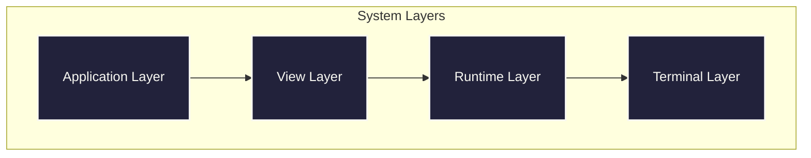
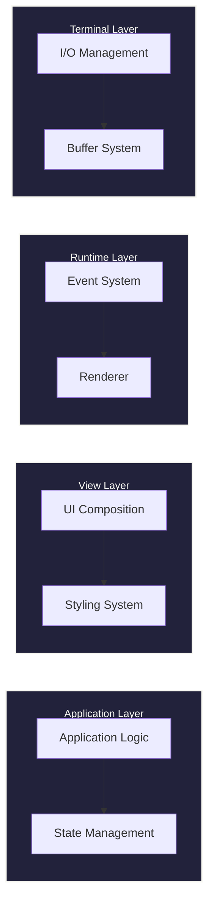
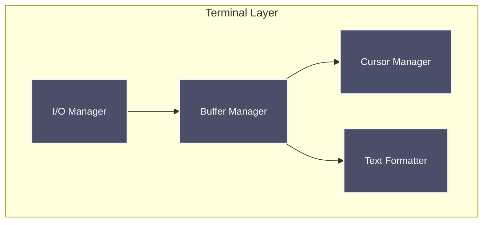
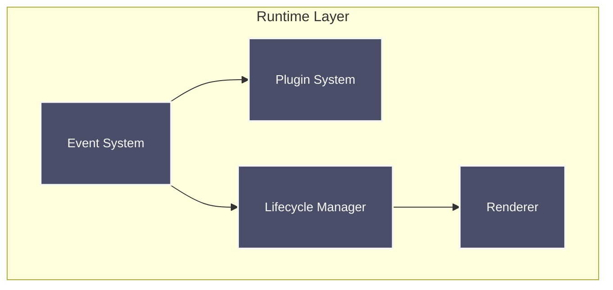
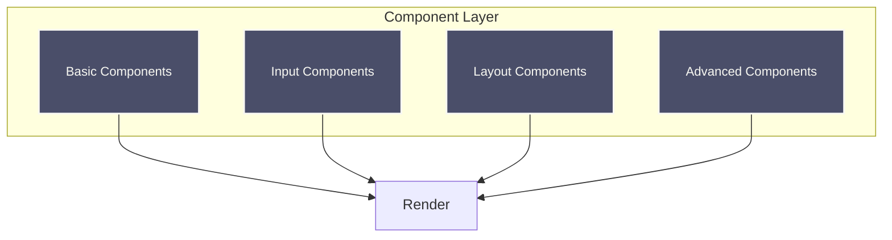
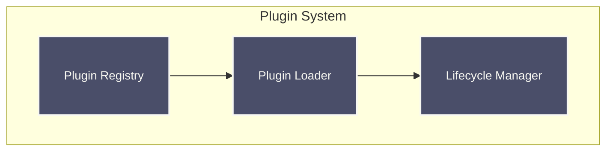
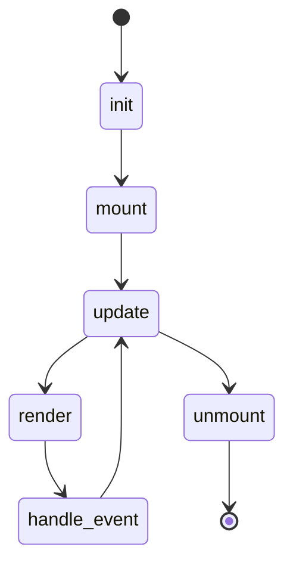
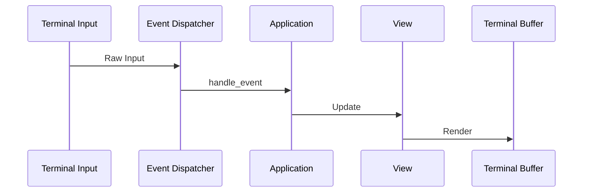
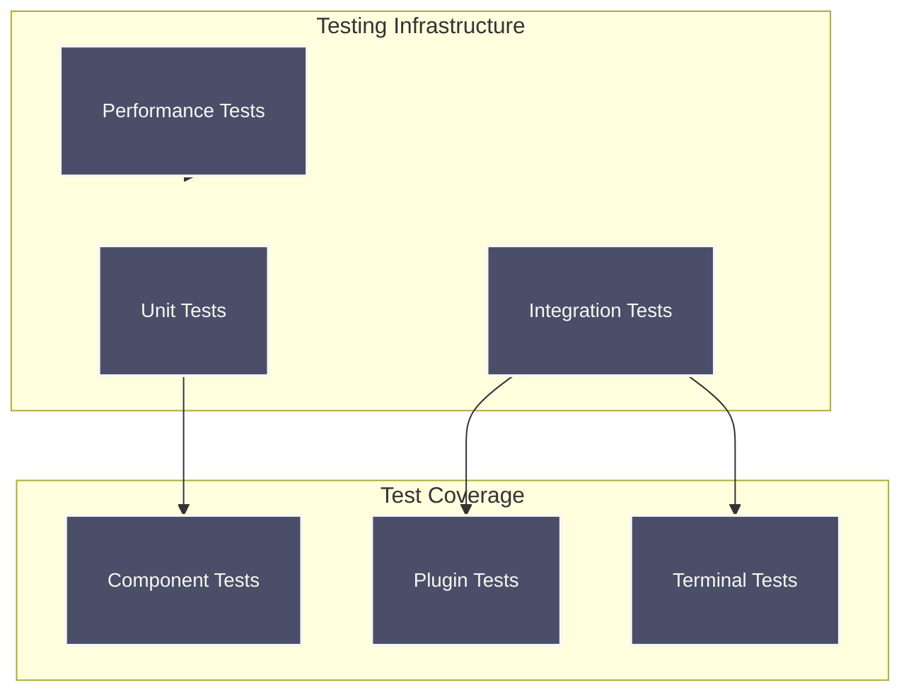

# Raxol Architecture

## System Overview

Raxol is a sophisticated terminal user interface toolkit that provides a comprehensive set of features for building interactive terminal applications. The system uses a layered architecture with clear separation of concerns:

### Layer Responsibilities

## Core Subsystems

### Terminal Layer

### Runtime Layer

### Component Layer

### Plugin System

### Component Lifecycle

## Event & Rendering Pipeline

## Performance Requirements

- **Event Processing:** < 1ms average, < 2ms 95th percentile
- **Screen Updates:** < 2ms average, < 5ms 95th percentile
- **Concurrent Operations:** < 5ms average, < 10ms 95th percentile

## Testing Infrastructure

## Design Principles

- **Elm-style update/view separation**: e.g. `Raxol.UI.Components.Base.Component`
- **NIF terminal I/O** (hosted in `priv/static/@static/termbox2_nif`): we maintain a [fork of this ourselves](https://github.com/Hydepwns/termbox2_nif)
- **Reusable, stateful components**: e.g. `Raxol.UI.Components.Base.Component`
- **Modular, extensible plugins**: e.g. `Raxol.Core.Runtime.Plugins.Plugin`
- **Adapter pattern for system/test**: e.g. `Raxol.Core.Runtime.System.Adapter`
- **Event-based async testing**: e.g. `Raxol.Core.Runtime.Events.Event`
- **Comprehensive test infrastructure**: e.g. `Raxol.Core.Runtime.Testing.Test`
- **Centralized color system**: e.g. `Raxol.Core.ColorSystem`

## References

- [Component Guide](../examples/guides/03_components_and_layout/components/README.md)
- [Plugin Development](../examples/guides/04_extending_raxol/plugin_development.md)
- [Testing Guide](../examples/guides/05_development_and_testing/testing.md)
