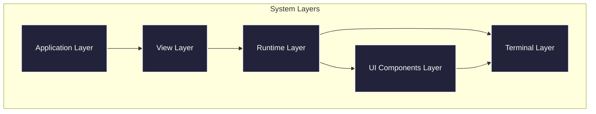
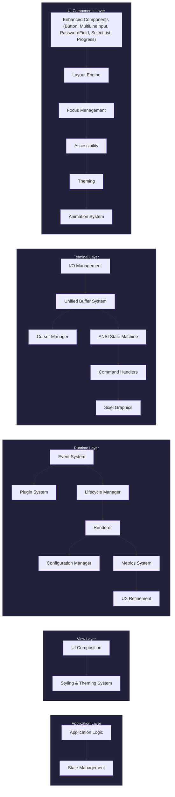
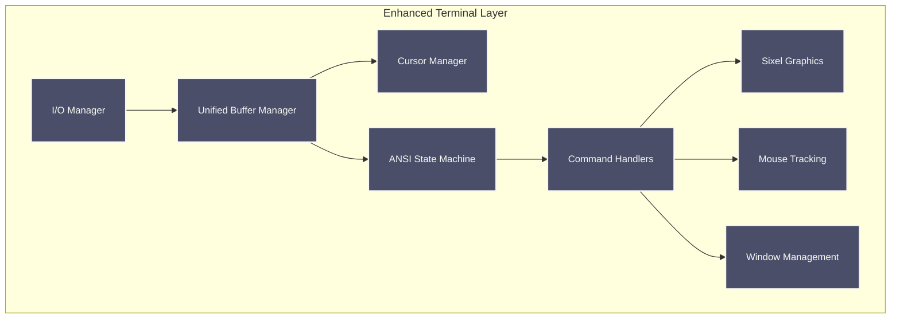
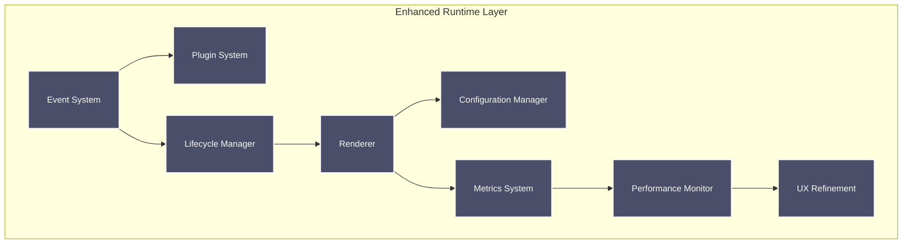
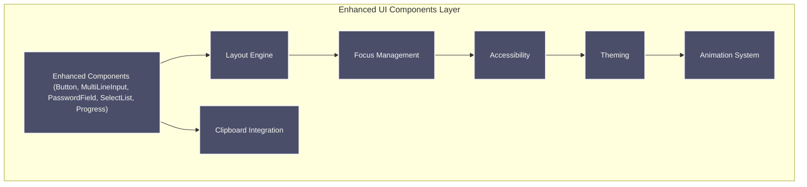
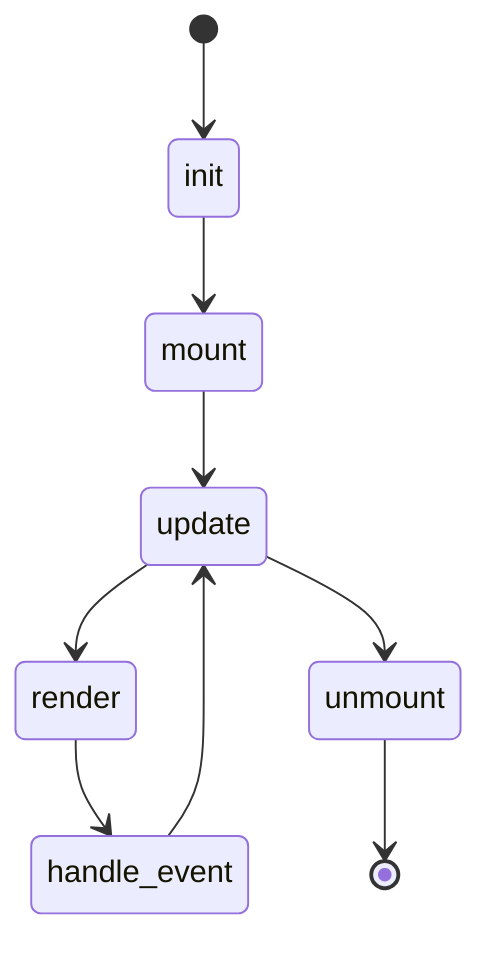
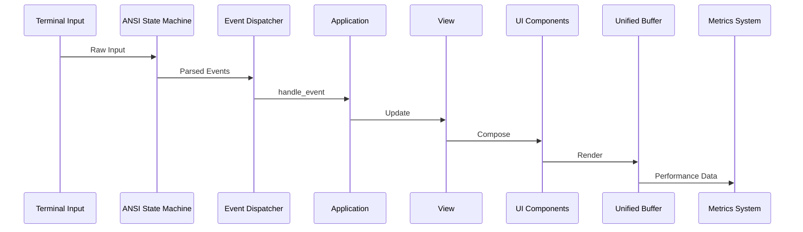
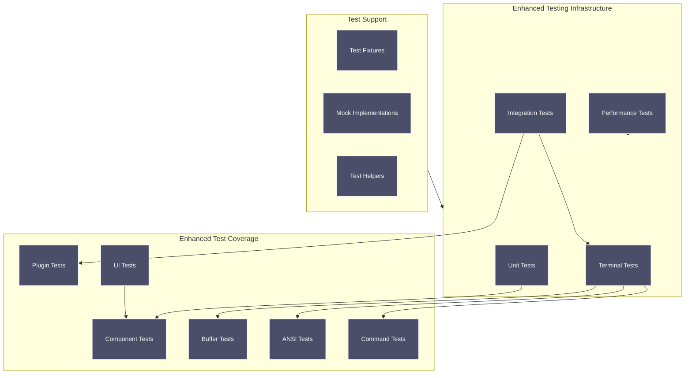

# Raxol Architecture

## System Overview

Raxol is a sophisticated terminal user interface toolkit that provides a comprehensive set of features for building interactive terminal applications. The system uses a layered architecture with clear separation of concerns and has been recently enhanced with improved terminal subsystems, core metrics, and UI components.

### Layer Responsibilities

## Core Subsystems

### Enhanced Terminal Layer

The terminal layer has been significantly refactored with improved organization and specialized modules:

### Enhanced Runtime Layer

The runtime layer now includes improved metrics, performance monitoring, and UX refinement:

### Enhanced UI Components Layer

The UI components layer has been updated with improved input components and layout engine:

### Enhanced Plugin System

The plugin system maintains its robust architecture with improved dependency management:

### Component Lifecycle

The component lifecycle remains consistent with improved error handling:

## Enhanced Event & Rendering Pipeline

## Performance Requirements

- **Event Processing:** < 1ms average, < 2ms 95th percentile
- **Screen Updates:** < 2ms average, < 5ms 95th percentile
- **Concurrent Operations:** < 5ms average, < 10ms 95th percentile
- **Terminal Operations:** < 0.5ms average, < 1ms 95th percentile

## Enhanced Testing Infrastructure

The testing infrastructure has been significantly improved with better organization and coverage:

## Recent Architectural Improvements

### Terminal Subsystem Enhancements

- **Unified Buffer Management:** Improved buffer operations with specialized modules for different concerns
- **Enhanced ANSI Processing:** Better state machine for escape sequence handling
- **Improved Command Handlers:** Standardized error handling and result propagation
- **Sixel Graphics Support:** Enhanced graphics rendering capabilities
- **Window Management:** Better window state handling and manipulation

### Core System Improvements

- **Metrics System:** Enhanced aggregation and visualization capabilities
- **Performance Monitoring:** Improved system performance tracking
- **UX Refinement:** Better accessibility and user experience features
- **Color System:** Enhanced theme management and color handling

### UI Component Enhancements

- **Input Components:** Improved multi-line input, password fields, and select lists
- **Layout Engine:** Enhanced layout processing and container management
- **Rendering Pipeline:** Better rendering performance and reliability
- **Clipboard Integration:** Improved clipboard handling across components

## Design Principles

- **Elm-style update/view separation**: e.g. `Raxol.UI.Components.Base.Component`
- **NIF terminal I/O** (hosted in `priv/static/@static/termbox2_nif`): we maintain a [fork of this ourselves](https://github.com/Hydepwns/termbox2_nif)
- **Reusable, stateful components**: e.g. `Raxol.UI.Components.Base.Component`
- **Unified error handling**: Consistent error/result tuples across all subsystems
- **Performance-first design**: Optimized for low-latency terminal operations
- **Comprehensive testing**: Extensive test coverage with improved reliability

## References

- [Component Guide](../examples/guides/03_components_and_layout/components/README.md)
- [Plugin Development](../examples/guides/04_extending_raxol/plugin_development.md)
- [Testing Guide](../examples/guides/05_development_and_testing/testing.md)
