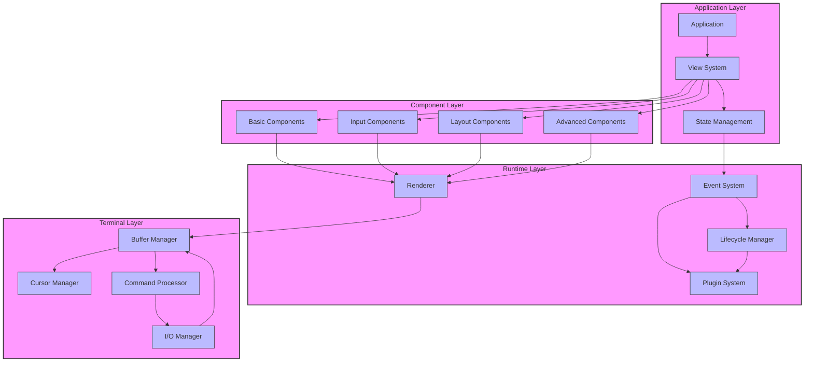
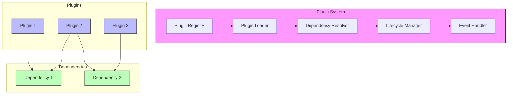
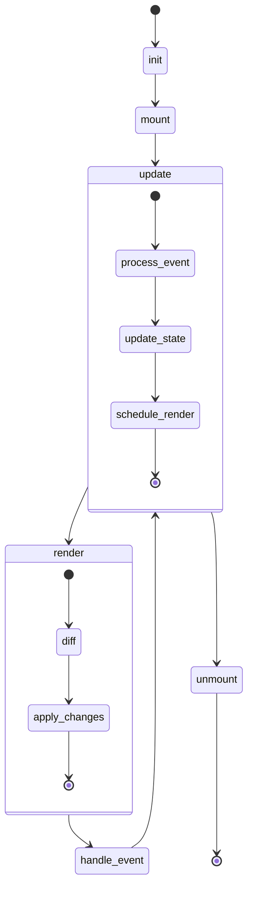
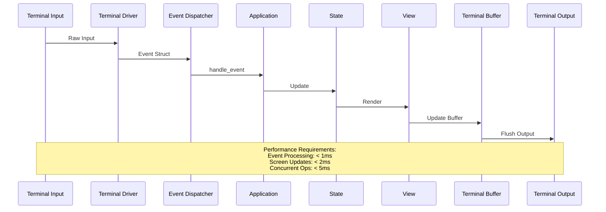
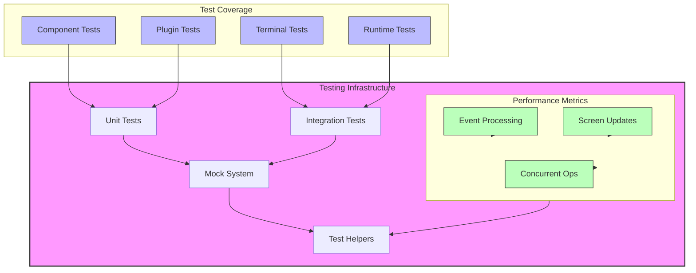

# Raxol Architecture

## System Overview

Raxol uses a layered architecture with clear separation of concerns:

```bash
┌───────────────┐
│ Application   │
├───────────────┤
│ View          │
├───────────────┤
│ Components    │
├───────────────┤
│ Runtime/Render│
├───────────────┤
│ Terminal      │
└───────────────┘
```

### Detailed Architecture Diagram



## Core Subsystems

### Terminal Layer

- **Purpose:** Terminal I/O, state, and rendering
- **Key Components:**
  - Buffer Management (State, Cursor, Damage, Memory, Scrollback)
  - Command Processing (CSI, OSC, DCS handlers)
  - Input/Output Management
  - Screen Buffer Optimization
- **Performance:** < 1ms event processing, < 2ms screen updates

### Runtime Layer

- **Purpose:** Application lifecycle and state management
- **Features:**
  - Event dispatch and handling
  - Plugin management
  - State synchronization
  - Performance monitoring
- **Performance:** < 5ms concurrent operations

### Component Layer

- **Purpose:** UI components and layout management
- **Features:**
  - Declarative View DSL
  - Component lifecycle hooks
  - Theme and style management
  - Layout system
- **Components:**
  - Basic: Text, Button, Panel
  - Input: TextInput, MultiLineInput, SelectList
  - Layout: Row, Column, Grid
  - Advanced: Table, Scrollbar, Progress

### Plugin System

- **Purpose:** Extensibility and modularity
- **Features:**
  - Hot-reloadable plugins
  - Dependency resolution (Tarjan's algorithm)
  - Lifecycle management
  - Event handling
  - Error recovery



### Component Lifecycle



## Event & Rendering Pipeline

```bash
[Terminal Input/Event]
        ↓
[Terminal Driver] → [Event Struct]
        ↓
[Event Dispatcher]
        ↓
[Application.handle_event]
        ↓
[State Update]
        ↓
[View Render]
        ↓
[Terminal Buffer]
        ↓
[Terminal Output]
```

### Pipeline Flow Diagram



## Performance Requirements

- **Event Processing:** < 1ms average, < 2ms 95th percentile
- **Screen Updates:** < 2ms average, < 5ms 95th percentile
- **Concurrent Operations:** < 5ms average, < 10ms 95th percentile

## Testing Infrastructure

- **Event-based synchronization** for async operations
- **Custom assertion helpers** for plugin/component lifecycle
- **Systematic use of Mox** for mocking
- **Test isolation** via unique state tracking
- **Performance testing** with defined requirements
- **Comprehensive coverage:** 1528 tests, 49 doctests



## Current Status (2025-05-10)

- **Test Suite:** 49 doctests, 1528 tests, 279 failures, 17 invalid, 21 skipped
- **Terminal subsystem refactoring complete**
- **Plugin system modularization complete**
- **Color system refactoring complete**
- **Performance infrastructure in place**

## Next Steps

1. Address remaining test failures
2. Complete OSC 4 handler implementation
3. Implement robust anchor checking
4. Document test writing guide
5. Continue code quality improvements

## Design Principles

- **Elm-style update/view separation**
- **NIF terminal I/O** (`rrex_termbox`)
- **Reusable, stateful components**
- **Modular, extensible plugins**
- **Adapter pattern for system/test**
- **Event-based async testing**
- **Comprehensive test infrastructure**
- **Centralized color system**

## References

- [Component Guide](../examples/guides/03_components_and_layout/components/README.md)
- [Plugin Development](../examples/guides/04_extending_raxol/plugin_development.md)
- [Testing Guide](../examples/guides/05_development_and_testing/testing.md)
- [Migration Guide](MIGRATION_GUIDE.md)
