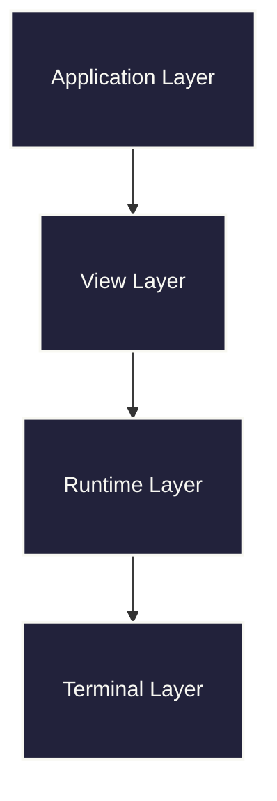
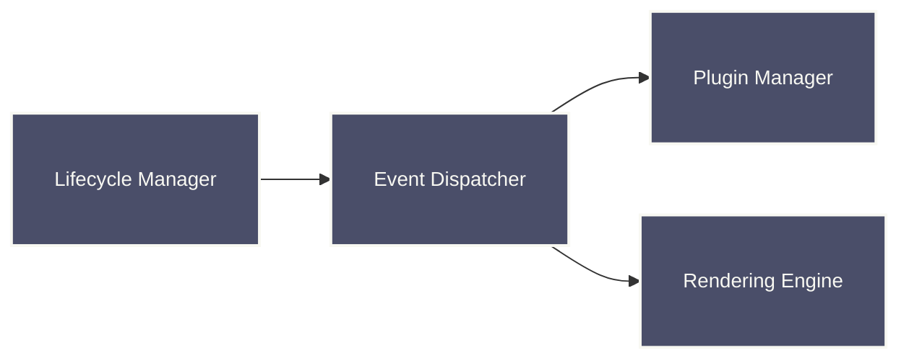
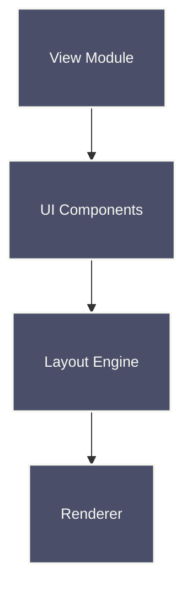
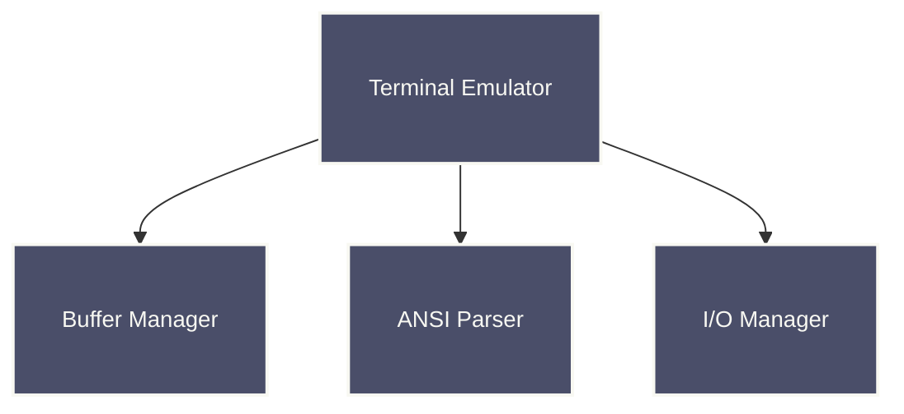
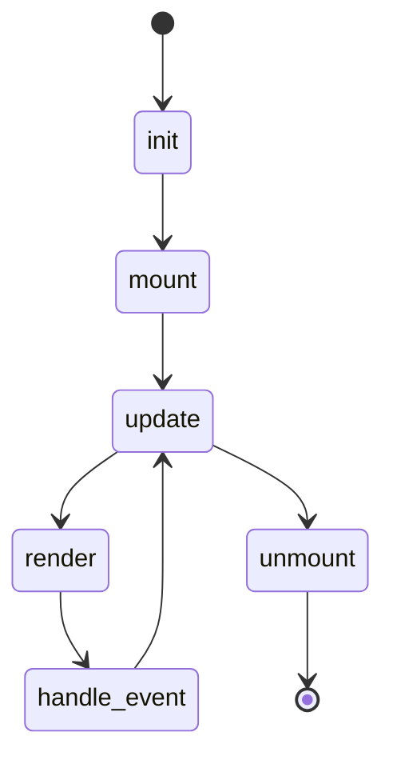
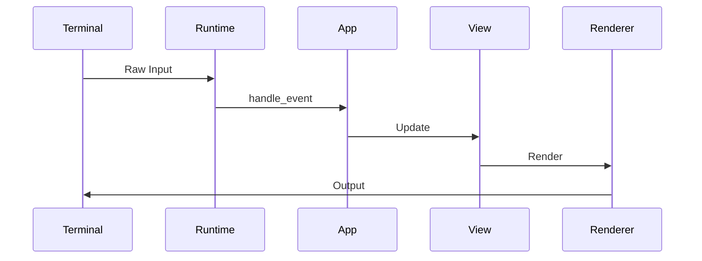

# Raxol Architecture

## System Overview

Raxol is a terminal user interface toolkit built on The Elm Architecture (TEA) that provides a comprehensive set of features for building interactive terminal applications. The system uses a layered architecture with clear separation of concerns.

### Layer Responsibilities

- **Application Layer**: User-defined application logic following TEA pattern
- **View Layer**: UI composition and rendering with components
- **Runtime Layer**: Event handling, lifecycle management, and coordination
- **Terminal Layer**: Low-level terminal interaction and buffer management

## Core Subsystems

### Application Runtime

The application runtime manages the lifecycle of Raxol applications:

### View System

The view system provides component-based UI composition:

### Terminal System

The terminal system handles low-level terminal operations:

## Application Lifecycle

## Event Flow

## Key Modules

### Application Layer

- `Raxol.Core.Runtime.Application` - Main application behaviour
- `Raxol.Core.Runtime.Lifecycle` - Application lifecycle management
- `Raxol.Core.Runtime.Events.Dispatcher` - Event dispatching

### View Layer

- `Raxol.Core.Renderer.View` - View composition and layout
- `Raxol.Core.Renderer.Layout` - Layout calculations
- `Raxol.UI.Components.*` - UI component library

### Runtime Layer

- `Raxol.Core.Runtime.Supervisor` - Runtime supervision
- `Raxol.Core.Runtime.Plugins.Manager` - Plugin management
- `Raxol.Core.Runtime.Rendering.Engine` - Rendering coordination

### Terminal Layer

- `Raxol.Terminal.Emulator` - Terminal emulation
- `Raxol.Terminal.Buffer.Manager` - Buffer management (now powered by the modular `BufferServerRefactored` system)
- `Raxol.Terminal.ANSI.*` - ANSI sequence handling

> **Note:** The buffer management subsystem was fully migrated from a monolithic GenServer (`BufferServer`) to the new modular `BufferServerRefactored` architecture. This new system is composed of focused modules for operation processing, batching, metrics, and damage tracking, resulting in a 42,000x performance improvement and greatly improved maintainability. All legacy code has been removed.

## Design Principles

- **Elm Architecture**: Model-Update-View pattern with unidirectional data flow
- **Component-based**: Reusable UI components with consistent interfaces
- **Performance-first**: Optimized for low-latency terminal operations
- **Extensible**: Plugin system for custom functionality
- **Accessible**: Built-in accessibility features and screen reader support

## Performance Requirements

- **Event Processing**: < 1ms average
- **Screen Updates**: < 2ms average
- **Concurrent Operations**: < 5ms average
- **Terminal Operations**: < 0.5ms average

## References

- [Component Guide](../examples/guides/03_components_and_layout/components/README.md)
- [Plugin Development](../examples/guides/04_extending_raxol/plugin_development.md)
- [Testing Guide](../examples/guides/05_development_and_testing/testing.md)
