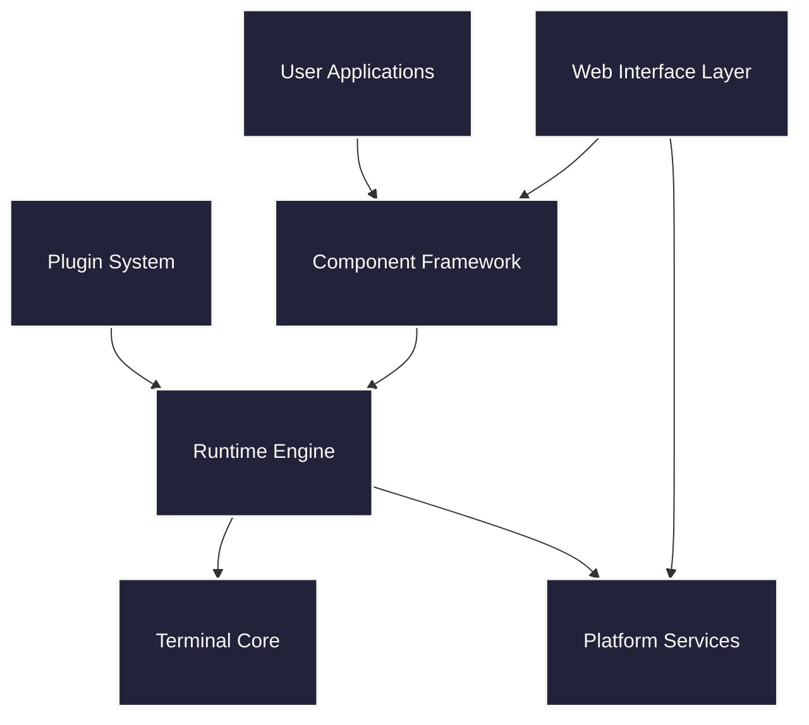
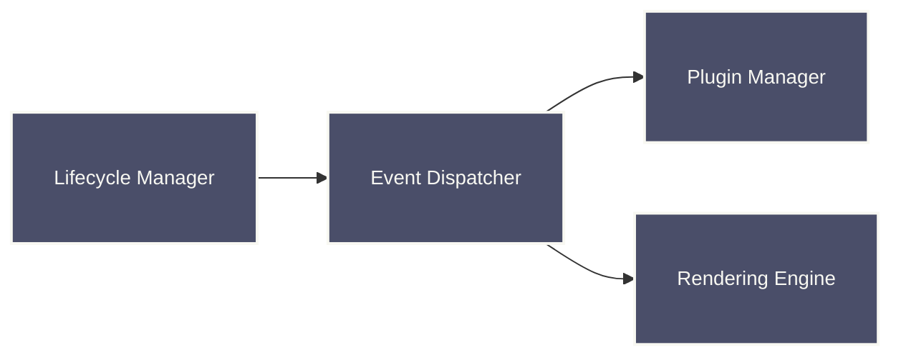
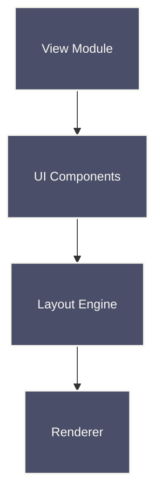
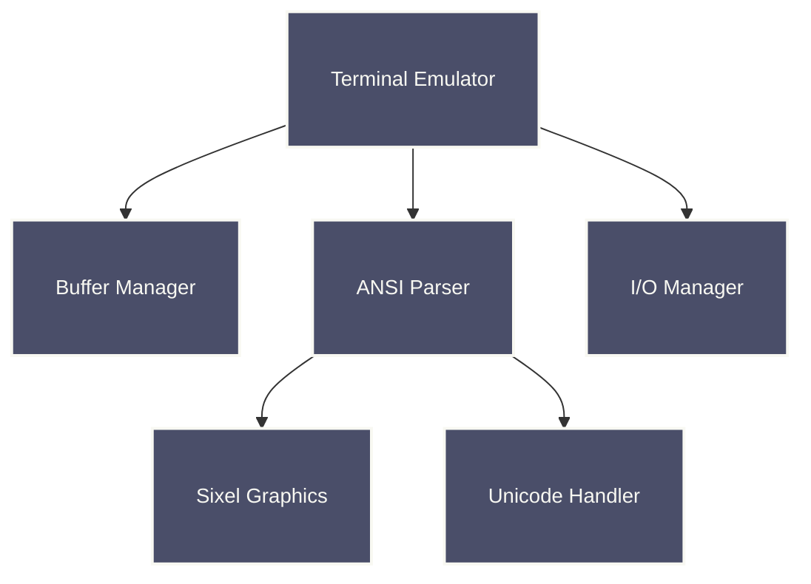
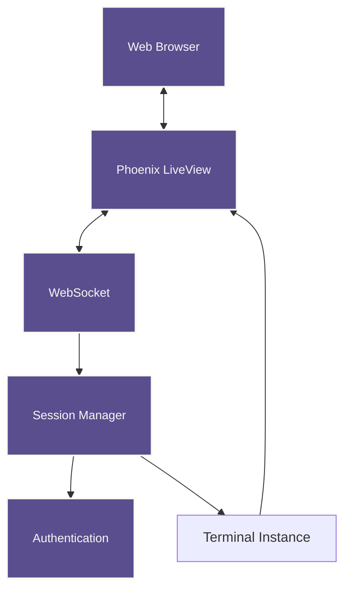
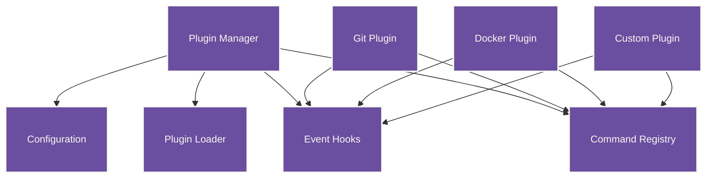
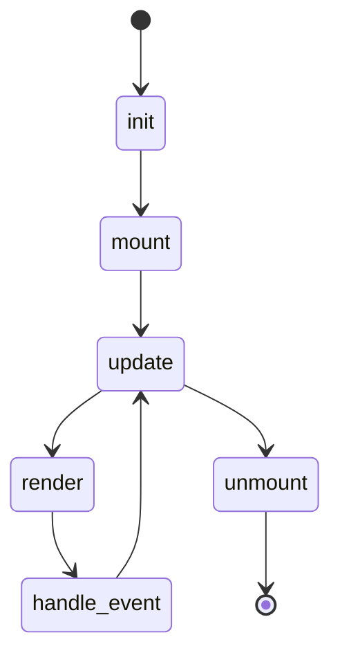
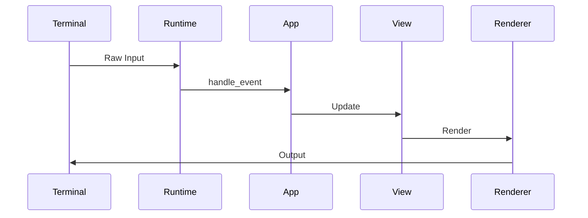

# Raxol Architecture

> **Architecture Decision Records**: All major architectural decisions are documented in [ADRs](./adr/README.md). This document provides an overview, while ADRs contain detailed decision context, alternatives considered, and validation metrics.

## System Overview

Raxol is a full-stack terminal application framework that enables building sophisticated terminal applications with both local and web interfaces. The framework combines a powerful terminal emulator core with a component-based UI system, real-time web capabilities, and an extensible plugin architecture.

### Layer Responsibilities

- **User Applications**: Terminal apps built using Raxol's component framework
- **Plugin System**: Runtime-loadable extensions with command registration and event hooks
- **Web Interface Layer**: Phoenix LiveView integration for browser-based access
- **Component Framework**: React-style UI components with state management and lifecycle
- **Runtime Engine**: Event handling, application lifecycle, and coordination
- **Terminal Core**: ANSI/VT100+ emulator with buffer management and rendering
- **Platform Services**: Authentication, metrics, configuration, and persistence

## Core Subsystems

### Application Runtime

The application runtime manages the lifecycle of Raxol applications:

### View System

The view system provides component-based UI composition:

### Terminal System

The terminal system provides comprehensive terminal emulation:

### Web Interface Architecture

The web layer enables browser-based access using Phoenix LiveView. See [ADR-0008: Phoenix LiveView Integration Architecture](./adr/0008-phoenix-liveview-integration-architecture.md) for the decision rationale and [ADR-0004: WASH-Style Web Continuity](./adr/0004-wash-style-web-continuity.md) for the continuity system design.

Key features:
- Real-time bidirectional communication via WebSockets
- Multi-user session support with presence tracking
- Collaborative cursor and state synchronization
- Persistent session storage and recovery
- Built-in authentication and authorization

### Plugin System Architecture

The plugin system enables runtime extensibility. See [ADR-0005: Runtime Plugin System Architecture](./adr/0005-runtime-plugin-system-architecture.md) for detailed decision context and implementation rationale.

Plugin capabilities:
- Runtime loading/unloading without restart
- Command registration with the terminal
- Event subscription and handling
- Configuration management
- Dependency resolution

## Application Lifecycle

## Event Flow

## Key Modules

### Application Layer

- `Raxol.Core.Runtime.Application` - Main application behaviour
- `Raxol.Core.Runtime.Lifecycle` - Application lifecycle management
- `Raxol.Core.Runtime.Events.Dispatcher` - Event dispatching

### Component Framework

The component system follows React-style patterns with lifecycle management. See [ADR-0001: Component-Based Architecture](./adr/0001-component-based-architecture.md) for the architectural decision and [ADR-0007: State Management Strategy](./adr/0007-state-management-strategy.md) for state handling patterns.

- `Raxol.UI.Components.Base.Component` - Component behaviour and lifecycle
- `Raxol.Core.Renderer.View` - View composition and layout
- `Raxol.Core.Renderer.Layout` - Layout calculations
- `Raxol.UI.Components.*` - Pre-built component library

### Web Interface Layer

- `RaxolWeb.TerminalLive` - Phoenix LiveView terminal interface
- `RaxolWeb.Channels.TerminalChannel` - WebSocket communication
- `RaxolWeb.Presence` - Multi-user presence tracking
- `Raxol.Accounts` - User authentication and management

### Plugin System

- `Raxol.Core.Runtime.Plugins.Manager` - Plugin lifecycle management
- `Raxol.Core.Runtime.Plugins.Registry` - Command registration
- `Raxol.Core.Runtime.Plugins.EventHandler` - Event hook system
- `Raxol.Plugin` - Plugin behaviour definition

### Terminal Core

- `Raxol.Terminal.Emulator` - Terminal emulation engine
- `Raxol.Terminal.Buffer.Manager` - Buffer management (powered by modular `BufferServerRefactored`)
- `Raxol.Terminal.ANSI.*` - ANSI/VT100+ sequence handling
- `Raxol.Terminal.Renderer` - Terminal rendering engine

### Platform Services

- `Raxol.Core.Config` - Configuration management
- `Raxol.Core.Metrics` - Telemetry and monitoring
- `Raxol.Security.*` - Authentication and security (see [ADR-0006: Enterprise Security and Compliance Model](./adr/0006-enterprise-security-and-compliance-model.md))
- `Raxol.Core.ErrorHandler` - Error handling and recovery

> **Note:** The buffer management subsystem was fully migrated from a monolithic GenServer (`BufferServer`) to the new modular `BufferServerRefactored` architecture. This new system is composed of focused modules for operation processing, batching, metrics, and damage tracking, resulting in a 42,000x performance improvement and greatly improved maintainability. All legacy code has been removed. See [ADR-0009: High-Performance Buffer Management](./adr/0009-high-performance-buffer-management.md) for the complete decision context and technical details.

## Design Principles

- **Full-Stack Framework**: Unified architecture for terminal and web applications
- **Component-Based Architecture**: React-style components with lifecycle management
- **Event-Driven Design**: Unidirectional data flow with predictable state updates
- **Performance Optimized**: Sub-millisecond local operations, minimal web latency
- **Runtime Extensibility**: Plugin system for adding functionality without restarts
- **Enterprise Ready**: Built-in auth, monitoring, and operational features
- **Accessibility First**: Screen reader support and keyboard navigation throughout

## Performance Requirements

- **Event Processing**: < 1ms average
- **Screen Updates**: < 2ms average
- **Concurrent Operations**: < 5ms average
- **Terminal Operations**: < 0.5ms average

## References

- [Component Guide](./examples/guides/03_components_and_layout/components/README.md)
- [Plugin Development](./examples/guides/04_extending_raxol/plugin_development.md)
- [Testing Guide](./examples/guides/05_development_and_testing/testing.md)
