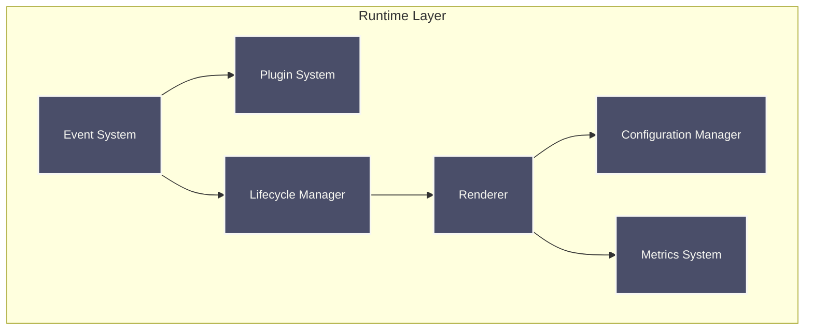
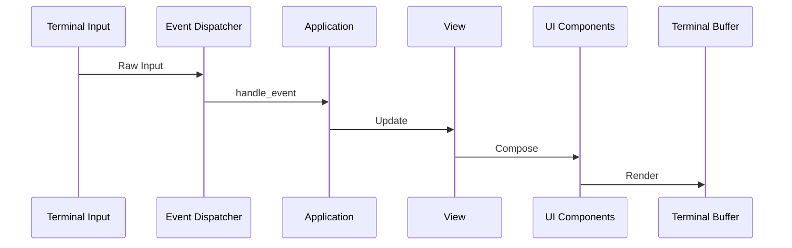

# Raxol Architecture

## System Overview

Raxol is a sophisticated terminal user interface toolkit that provides a comprehensive set of features for building interactive terminal applications. The system uses a layered architecture with clear separation of concerns:


### Layer Responsibilities

```mermaid
graph LR
    subgraph App["Application Layer"]
        direction TB
        Logic[Application Logic]
        State[State Management]
        Logic --> State
    end

    subgraph View["View Layer"]
        direction TB
        UIComp[UI Composition]
        Style[Styling & Theming System]
        UIComp --> Style
    end

    subgraph Runtime["Runtime Layer"]
        direction TB
        Events[Event System]
        Render[Renderer]
        Plugins[Plugin System]
        Lifecycle[Lifecycle Manager]
        Config[Configuration Manager]
        Metrics[Metrics System]
        Events --> Plugins
        Events --> Lifecycle
        Lifecycle --> Render
        Render --> Config
        Render --> Metrics
    end

    subgraph Terminal["Terminal Layer"]
        direction TB
        IO[I/O Management]
        Buffer[Buffer System]
        Cursor[Cursor Manager]
        Formatter[Text Formatter]
        IO --> Buffer
        Buffer --> Cursor
        Buffer --> Formatter
    end

    subgraph UI["UI Components Layer"]
        direction TB
        Basic[Basic Components (Button, TextInput, Table, Modal, TabBar, Progress)]
        Layout[Layout Components]
        Focus[Focus Management]
        Accessibility[Accessibility]
        Theming[Theming]
        Animation[Animation System]
        Basic --> Layout
        Layout --> Focus
        Focus --> Accessibility
        Accessibility --> Theming
        Theming --> Animation
    end

    classDef layer fill:#22223b,stroke:#f8f8f2,stroke-width:2px,color:#f8f8f2,font-size:14px,padding:6px;
    class App,View,Runtime,Terminal,UI layer;
```

## Core Subsystems

### Terminal Layer


### Runtime Layer



### UI Components Layer

```mermaid
graph TB
    subgraph UI["UI Components Layer"]
        Basic[Basic Components (Button, TextInput, Table, Modal, TabBar, Progress)]
        Layout[Layout Components]
        Focus[Focus Management]
        Accessibility[Accessibility]
        Theming[Theming]
        Animation[Animation System]
    end

    Basic --> Layout
    Layout --> Focus
    Focus --> Accessibility
    Accessibility --> Theming
    Theming --> Animation

    classDef component fill:#4a4e69,stroke:#f8f8f2,stroke-width:2px,color:#f8f8f2,font-size:14px,padding:6px;
    class Basic,Layout,Focus,Accessibility,Theming,Animation component;
```

### Plugin System


### Component Lifecycle


## Event & Rendering Pipeline



## Performance Requirements

- **Event Processing:** < 1ms average, < 2ms 95th percentile
- **Screen Updates:** < 2ms average, < 5ms 95th percentile
- **Concurrent Operations:** < 5ms average, < 10ms 95th percentile

## Testing Infrastructure


## Design Principles

- **Elm-style update/view separation**: e.g. `Raxol.UI.Components.Base.Component`
- **NIF terminal I/O** (hosted in `priv/static/@static/termbox2_nif`): we maintain a [fork of this ourselves](https://github.com/Hydepwns/termbox2_nif)
- **Reusable, stateful components**: e.g. `Raxol.UI.Components.Base.Component`
- **Modular, extensible plugins**: e.g. `Raxol.Core.Runtime.Plugins.Plugin`
- **Adapter pattern for system/test**: e.g. `Raxol.Core.Runtime.System.Adapter`
- **Event-based async testing**: e.g. `Raxol.Core.Runtime.Events.Event`
- **Comprehensive test infrastructure**: e.g. `Raxol.Core.Runtime.Testing.Test`
- **Centralized color/theming system**: e.g. `Raxol.Core.ColorSystem`, theming modules
- **Accessibility and focus management**: e.g. `Raxol.Core.Accessibility`, `Raxol.UI.Components.FocusRing`
- **Configuration and metrics**: e.g. `Raxol.Core.Config`, `Raxol.Core.Metrics`
- **Animation system**: e.g. `Raxol.Terminal.Animation`

## References

- [Component Guide](../examples/guides/03_components_and_layout/components/README.md)
- [Plugin Development](../examples/guides/04_extending_raxol/plugin_development.md)
- [Testing Guide](../examples/guides/05_development_and_testing/testing.md)
