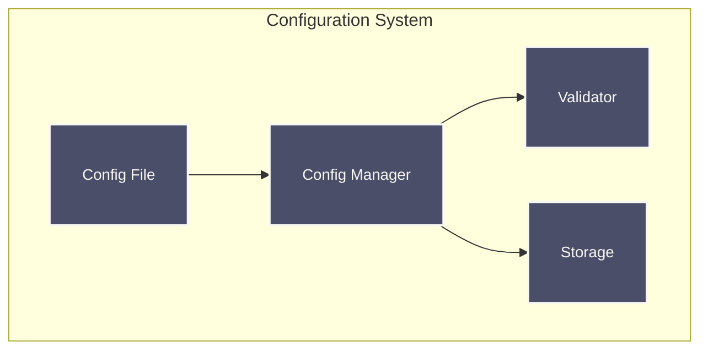
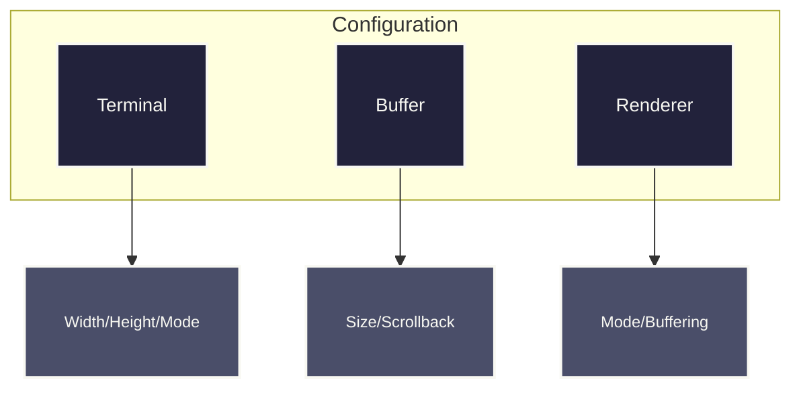
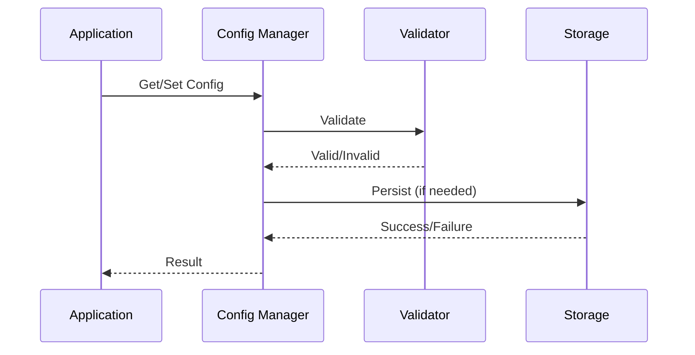
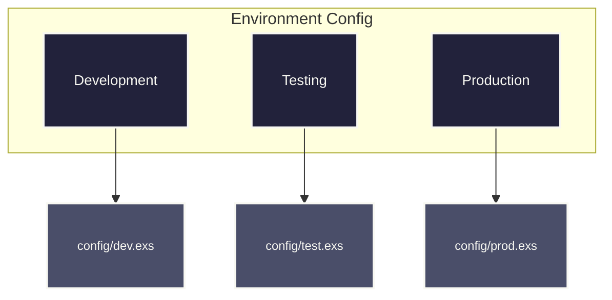

# Raxol Terminal Emulator Configuration Guide

## Overview

The Raxol Terminal Emulator uses a centralized configuration system that manages all aspects of the terminal's operation.



## Configuration Structure



## Configuration File

Located at `config/raxol.exs`:

```elixir
import Config

config :raxol,
  terminal: %{
    width: 80,
    height: 24,
    mode: :normal
  },
  buffer: %{
    max_size: 10000,
    scrollback: 1000
  },
  renderer: %{
    mode: :gpu,
    double_buffering: true
  }
```

## Configuration Sections

### Terminal Configuration

```elixir
terminal: %{
  width: 80,        # Terminal width in characters
  height: 24,       # Terminal height in characters
  mode: :normal     # Terminal mode (:normal or :raw)
}
```

### Buffer Configuration

```elixir
buffer: %{
  max_size: 10_000,  # Maximum buffer size in characters
  scrollback: 1000   # Number of lines to keep in scrollback
}
```

### Renderer Configuration

```elixir
renderer: %{
  mode: :gpu,           # Rendering mode (:gpu or :cpu)
  double_buffering: true # Whether to use double buffering
}
```

## Runtime Configuration



### Configuration Manager API

```elixir
# Get configuration
width = Raxol.Core.Config.Manager.get(:terminal_width)

# Set configuration
:ok = Raxol.Core.Config.Manager.set(:terminal_width, 100)

# Update configuration
:ok = Raxol.Core.Config.Manager.update(:terminal_width, &(&1 + 50))

# Delete configuration
:ok = Raxol.Core.Config.Manager.delete(:custom_key)

# Get all configuration
config = Raxol.Core.Config.Manager.get_all()

# Reload configuration
:ok = Raxol.Core.Config.Manager.reload()
```

## Environment-Specific Configuration



## Validation Rules

```mermaid
graph TB
    subgraph Rules["Validation Rules"]
        Terminal[Terminal Rules]
        Buffer[Buffer Rules]
        Renderer[Renderer Rules]
    end

    Terminal --> T1[Width > 0]
    Terminal --> T2[Height > 0]
    Terminal --> T3[Mode in [:normal, :raw]]

    Buffer --> B1[Max Size > 0]
    Buffer --> B2[Scrollback >= 0]

    Renderer --> R1[Mode in [:gpu, :cpu]]
    Renderer --> R2[Double Buffering is boolean]

    classDef rule fill:#22223b,stroke:#f8f8f2,stroke-width:2px,color:#f8f8f2,font-size:14px,padding:6px;
    classDef check fill:#4a4e69,stroke:#f8f8f2,stroke-width:2px,color:#f8f8f2,font-size:12px,padding:4px;
    class Terminal,Buffer,Renderer rule
    class T1,T2,T3,B1,B2,R1,R2 check;
```

## Best Practices

1. **Organization**

   - Group related settings
   - Use descriptive names
   - Document options

2. **Validation**

   - Validate all values
   - Provide clear errors
   - Handle invalid configs

3. **Security**
   - No sensitive data
   - Use env variables
   - Validate inputs

## Troubleshooting

### Common Issues

1. **Invalid Configuration**

   - Check required fields
   - Verify value types
   - Check syntax

2. **Loading Issues**

   - Verify file path
   - Check permissions
   - Validate syntax

3. **Persistence Issues**
   - Check persist option
   - Verify permissions
   - Check write errors

## API Reference

### Raxol.Core.Config.Manager

| Function       | Description    |
| -------------- | -------------- |
| `start_link/1` | Start manager  |
| `get/2`        | Get value      |
| `set/3`        | Set value      |
| `update/3`     | Update value   |
| `delete/2`     | Delete value   |
| `get_all/0`    | Get all values |
| `reload/0`     | Reload config  |

## Support

For issues and feature requests, please use the [issue tracker](https://github.com/raxol/raxol/issues).
