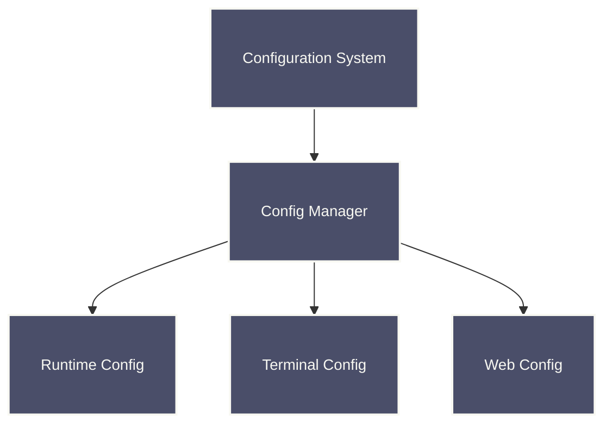

# Raxol Configuration Guide

## Overview

Raxol uses a centralized configuration system that manages all aspects of the application's operation, including terminal settings, runtime options, and environment-specific configurations.



## Configuration Structure

Raxol's configuration is organized into several key sections:

- **Runtime Configuration**: Application lifecycle and core settings
- **Terminal Configuration**: Terminal emulator settings
- **Web Configuration**: Web interface settings
- **Database Configuration**: Database connection and settings

## Configuration Files

### Main Configuration

Located at `config/config.exs`:

```elixir
import Config

# General application configuration
config :raxol,
  ecto_repos: [Raxol.Repo],
  generators: [binary_id: true]

# Configure the endpoint
config :raxol, RaxolWeb.Endpoint,
  url: [host: "localhost"],
  render_errors: [
    formats: [html: RaxolWeb.ErrorHTML, json: RaxolWeb.ErrorJSON],
    layout: false
  ],
  pubsub_server: Raxol.PubSub,
  live_view: [signing_salt: "your-signing-salt"]
```

### Environment-Specific Configuration

#### Development (`config/dev.exs`)

```elixir
import Config

# Terminal settings for development
config :raxol, :terminal,
  default_width: 80,
  default_height: 24,
  scrollback_lines: 1000,
  enable_ansi: true,
  enable_mouse: true,
  debug_mode: false,
  log_level: :info

# Web interface settings for development
config :raxol, :web,
  default_theme: "light",
  enable_websockets: true,
  session_timeout: 3600,
  debug_mode: false,
  enable_hot_reload: true
```

#### Production (`config/prod.exs`)

```elixir
import Config

# Terminal settings for production
config :raxol, :terminal,
  default_width: 80,
  default_height: 24,
  scrollback_lines: 1000,
  enable_ansi: true,
  enable_mouse: true,
  debug_mode: false,
  log_level: :info

# Web interface settings for production
config :raxol, :web,
  default_theme: "light",
  enable_websockets: true,
  session_timeout: 3600,
  debug_mode: false,
  enable_hot_reload: false
```

### Runtime Configuration

Located at `config/runtime.exs`:

```elixir
import Config

# Configure terminal settings from environment
config :raxol, :terminal,
  default_width: String.to_integer(System.get_env("TERMINAL_WIDTH") || "80"),
  default_height: String.to_integer(System.get_env("TERMINAL_HEIGHT") || "24"),
  scrollback_lines: String.to_integer(System.get_env("TERMINAL_SCROLLBACK") || "1000"),
  enable_ansi: System.get_env("TERMINAL_ANSI", "true") == "true",
  enable_mouse: System.get_env("TERMINAL_MOUSE", "true") == "true",
  debug_mode: System.get_env("TERMINAL_DEBUG", "false") == "true",
  log_level: String.to_atom(System.get_env("TERMINAL_LOG_LEVEL") || "info")

# Configure web interface settings from environment
config :raxol, :web,
  default_theme: System.get_env("WEB_THEME", "light"),
  enable_websockets: System.get_env("WEB_WEBSOCKETS", "true") == "true",
  session_timeout: String.to_integer(System.get_env("WEB_SESSION_TIMEOUT") || "3600"),
  debug_mode: System.get_env("WEB_DEBUG", "false") == "true",
  enable_hot_reload: System.get_env("WEB_HOT_RELOAD", "false") == "true"
```

## Configuration Sections

### Terminal Configuration

```elixir
terminal: %{
  default_width: 80,        # Terminal width in characters
  default_height: 24,       # Terminal height in characters
  scrollback_lines: 1000,   # Number of lines to keep in scrollback
  enable_ansi: true,        # Enable ANSI escape sequences
  enable_mouse: true,       # Enable mouse tracking
  debug_mode: false,        # Enable debug mode
  log_level: :info          # Log level (:debug, :info, :warn, :error)
}
```

### Web Configuration

```elixir
web: %{
  default_theme: "light",           # Default theme
  enable_websockets: true,          # Enable WebSocket support
  session_timeout: 3600,            # Session timeout in seconds
  debug_mode: false,                # Enable debug mode
  enable_hot_reload: false,         # Enable hot reloading
  reduced_motion: false,            # Reduce animations
  high_contrast: false,             # Enable high contrast mode
  font_family: "JetBrains Mono, SF Mono, monospace",
  font_size: 14,
  line_height: 1.2
}
```

### Database Configuration

#### Nix Environment (Recommended)

When using the Nix development environment, PostgreSQL is automatically configured:

```elixir
config :raxol, Raxol.Repo,
  username: "postgres",
  password: nil,  # Trust authentication in Nix environment
  hostname: "localhost",
  database: "raxol_dev",
  pool_size: 10,
  timeout: 15_000,
  idle_timeout: 30_000
```

#### Manual Installation

```elixir
config :raxol, Raxol.Repo,
  username: "postgres",
  password: "postgres",
  hostname: "localhost",
  database: "raxol_dev",
  pool_size: 10,
  timeout: 15_000,
  idle_timeout: 30_000
```

## Environment Variables

### Nix Environment Variables

When using the Nix development environment, the following environment variables are automatically set:

- `ERLANG_PATH`: Path to Erlang installation
- `ELIXIR_PATH`: Path to Elixir installation
- `ERL_EI_INCLUDE_DIR`: Erlang include directory (for native compilation)
- `ERL_EI_LIBDIR`: Erlang library directory (for native compilation)
- `PGDATA`: PostgreSQL data directory (`$PWD/.postgres`)
- `PGHOST`: PostgreSQL host (`$PWD/.postgres`)
- `PGPORT`: PostgreSQL port (5432)
- `MIX_ENV`: Mix environment (dev)
- `MAGICK_HOME`: ImageMagick installation path
- `NODE_PATH`: Node.js modules path

### Custom Environment Variables

You can override these settings by setting environment variables before entering the Nix shell:

```bash
export PGPORT=5433
export MIX_ENV=test
nix-shell
```

## Runtime Configuration API

### Configuration Manager

Raxol provides a configuration manager for runtime configuration updates:

```elixir
# Get configuration value
width = Raxol.Core.Config.Manager.get(:terminal_width, 80)

# Set configuration value
:ok = Raxol.Core.Config.Manager.set(:terminal_width, 100)

# Update configuration value
:ok = Raxol.Core.Config.Manager.update(:terminal_width, &(&1 + 50))

# Get all configuration
config = Raxol.Core.Config.Manager.get_all()
```

### Core Configuration

```elixir
# Get user preference
theme = Raxol.Core.get_preference(:theme, :default)

# Set user preference
:ok = Raxol.Core.set_preference(:theme, :dark)

# Get system information
{:ok, info} = Raxol.Core.get_system_info()
```

## Environment Variables

Raxol respects these environment variables for configuration:

### Terminal Settings

- `TERMINAL_WIDTH`: Terminal width (default: 80)
- `TERMINAL_HEIGHT`: Terminal height (default: 24)
- `TERMINAL_SCROLLBACK`: Scrollback lines (default: 1000)
- `TERMINAL_ANSI`: Enable ANSI (default: true)
- `TERMINAL_MOUSE`: Enable mouse (default: true)
- `TERMINAL_DEBUG`: Debug mode (default: false)
- `TERMINAL_LOG_LEVEL`: Log level (default: info)

### Web Settings

- `WEB_THEME`: Default theme (default: light)
- `WEB_WEBSOCKETS`: Enable WebSockets (default: true)
- `WEB_SESSION_TIMEOUT`: Session timeout (default: 3600)
- `WEB_DEBUG`: Debug mode (default: false)
- `WEB_HOT_RELOAD`: Hot reload (default: false)

### Application Settings

- `RAXOL_THEME`: Set the default theme
- `RAXOL_NO_COLOR`: Disable colors if set to `1` or `true`
- `RAXOL_DEBUG`: Enable debug mode if set to `1` or `true`
- `RAXOL_LOG_LEVEL`: Set the log level

## Best Practices

1. **Environment Separation**

   - Use environment-specific config files
   - Override with environment variables in production
   - Keep sensitive data out of version control

2. **Validation**

   - Validate configuration values at startup
   - Provide clear error messages for invalid configs
   - Use sensible defaults

3. **Security**
   - Use environment variables for sensitive data
   - Validate all configuration inputs
   - Avoid hardcoding secrets

## Troubleshooting

### Common Issues

1. **Configuration Not Loading**

   - Check file paths and permissions
   - Verify syntax in config files
   - Check environment variable names

2. **Invalid Configuration**

   - Review validation error messages
   - Check data types and ranges
   - Verify required fields are present

3. **Runtime Configuration Issues**
   - Ensure configuration manager is started
   - Check GenServer call timeouts
   - Verify configuration keys exist

## API Reference

### Raxol.Core.Config.Manager

| Function       | Description                 |
| -------------- | --------------------------- |
| `start_link/1` | Start configuration manager |
| `get/2`        | Get configuration value     |
| `set/3`        | Set configuration value     |
| `update/3`     | Update configuration value  |
| `get_all/0`    | Get all configuration       |

### Raxol.Core

| Function            | Description            |
| ------------------- | ---------------------- |
| `get_preference/2`  | Get user preference    |
| `set_preference/2`  | Set user preference    |
| `get_system_info/0` | Get system information |

## Support

For configuration issues and questions, please use the [issue tracker](https://github.com/Hydepwns/raxol/issues).
