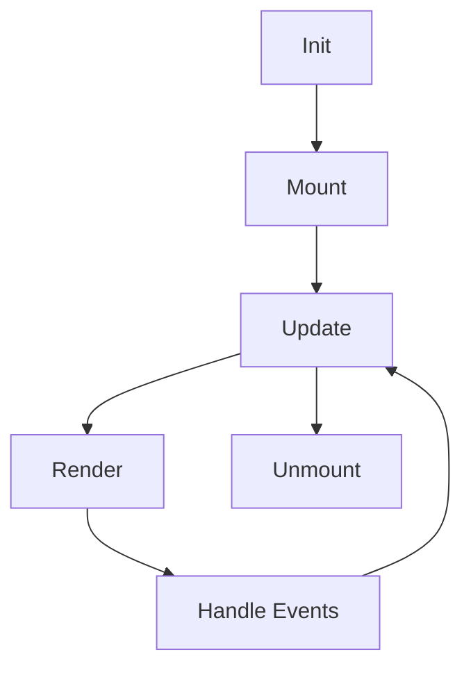

# Component Guide

Complete guide to Raxol's component system for building applications that work seamlessly in both terminal and web environments.

## Quick Reference

- [Architecture](#architecture) - Component system design for terminal and web
- [Writing Components](#writing-components) - Creating components with dual rendering
- [Web Rendering](#web-rendering) - Components in the browser via Phoenix LiveView
- [Testing](#testing) - Component testing patterns
- [Style Guide](style_guide.md) - Component styling

## Architecture

### Component Lifecycle



### Core Principles

- **Unidirectional Data Flow**: State flows down, events flow up
- **Component Composition**: Build complex UIs from simple components
- **Lifecycle Management**: Clear hooks for setup and cleanup
- **Event Handling**: Consistent event system across terminal and web
- **Dual Rendering**: Components render correctly in both environments
- **Real-Time Sync**: State synchronization across multiple clients

## Writing Components

### Basic Component Structure

```elixir
defmodule MyComponent do
  @behaviour Raxol.UI.Components.Base.Component

  def init(props) do
    Map.merge(%{
      value: "",
      mounted: false,
      events: []
    }, props)
  end

  def mount(state) do
    {Map.put(state, :mounted, true), []}
  end

  def update({:set_value, value}, state) do
    {Map.put(state, :value, value), []}
  end

  def render(state) do
    %{
      type: :text_input,
      value: state.value,
      mounted: state.mounted
    }
  end

  def handle_event(%{type: :change, value: value}, state) do
    new_state = Map.put(state, :value, value)
    {new_state, [{:command, :value_changed}]}
  end

  def unmount(state) do
    Map.put(state, :mounted, false)
  end
end
```

### Component Patterns

#### Stateful Components

```elixir
defmodule Counter do
  @behaviour Raxol.UI.Components.Base.Component

  def init(_props) do
    %{count: 0, clicks: 0}
  end

  def update(:increment, state) do
    new_state = %{state |
      count: state.count + 1,
      clicks: state.clicks + 1
    }
    {new_state, [{:command, :count_updated}]}
  end

  def render(state) do
    %{
      type: :box,
      content: [
        %{type: :text, content: "Count: #{state.count}"},
        %{type: :button, label: "Increment", on_click: :increment}
      ]
    }
  end
end
```

#### Stateless Components

```elixir
defmodule Display do
  @behaviour Raxol.UI.Components.Base.Component

  def init(props) do
    %{value: props[:value] || ""}
  end

  def render(state) do
    %{
      type: :text,
      content: state.value,
      color: :cyan
    }
  end
end
```

### Event Handling

```elixir
def handle_event(%{type: :key_press, key: :enter}, state) do
  # Handle enter key
  {state, [{:command, :submitted}]}
end

def handle_event(%{type: :mouse_click, x: x, y: y}, state) do
  # Handle mouse click
  {state, [{:command, {:clicked, x, y}}]}
end

def handle_event(%{type: :focus}, state) do
  # Handle focus
  {Map.put(state, :focused, true), []}
end
```

### Command System

```elixir
def update({:set_value, value}, state) do
  new_state = Map.put(state, :value, value)
  {new_state, [
    {:command, :value_changed},
    {:command, {:notify_parent, value}}
  ]}
end
```

## Web Rendering

Raxol components automatically work in web browsers through Phoenix LiveView integration. The same component code runs in both terminal and web environments.

### How Web Rendering Works

1. **Automatic Translation**: Component render output is translated to HTML
2. **Event Mapping**: Terminal events map to browser events
3. **Real-Time Updates**: State changes propagate via WebSockets
4. **Style Preservation**: Terminal styles convert to CSS

### Web-Aware Component

```elixir
defmodule TodoItem do
  @behaviour Raxol.UI.Components.Base.Component

  def render(state, context) do
    # This works in both terminal and web!
    %{
      type: :row,
      style: [padding: 1, hover: true],
      content: [
        %{
          type: :checkbox,
          checked: state.completed,
          on_change: {:toggle, state.id}
        },
        %{
          type: :text,
          content: state.text,
          style: [strikethrough: state.completed]
        },
        %{
          type: :button,
          label: "Delete",
          on_click: {:delete, state.id},
          style: [color: :red]
        }
      ]
    }
  end
end
```

### Web-Specific Features

#### Responsive Design

```elixir
def render(state, context) do
  # Access viewport information
  is_mobile = context.viewport.width < 768
  
  %{
    type: :box,
    style: [
      padding: if(is_mobile, do: 1, else: 2),
      flex_direction: if(is_mobile, do: :column, else: :row)
    ],
    content: render_content(state, is_mobile)
  }
end
```

#### Collaborative Features

```elixir
def render(state, context) do
  # Show other users' cursors
  %{
    type: :box,
    content: [
      render_content(state),
      render_user_cursors(context.presence)
    ]
  }
end

defp render_user_cursors(presence) do
  Enum.map(presence.users, fn user ->
    %{
      type: :cursor,
      user_id: user.id,
      position: user.cursor,
      color: user.color
    }
  end)
end
```

### Browser Events

Components handle browser-specific events seamlessly:

```elixir
def handle_event(%{type: :mouse_enter}, state) do
  # Works in terminal (if supported) and web
  {Map.put(state, :hovered, true), []}
end

def handle_event(%{type: :drag_start, data: data}, state) do
  # Drag and drop support in web
  {Map.put(state, :dragging, data), []}
end

def handle_event(%{type: :file_drop, files: files}, state) do
  # File upload in web
  {state, [{:command, {:process_files, files}}]}
end
```

### Performance in Web

#### Virtual DOM Optimization

```elixir
def render(state, context) do
  # Use keys for efficient list rendering
  %{
    type: :list,
    content: Enum.map(state.items, fn item ->
      %{
        type: :list_item,
        key: item.id,  # Important for web performance
        content: render_item(item)
      }
    end)
  }
end
```

#### Lazy Loading

```elixir
def render(state, context) do
  %{
    type: :virtual_list,  # Only renders visible items
    height: 500,
    item_height: 50,
    items: state.large_dataset,
    render_item: &render_item/1
  }
end
```

### Web Deployment

Components deployed to web automatically get:

1. **Session Persistence**: State survives page refreshes
2. **URL Routing**: Deep linking to component states
3. **SEO Support**: Server-side rendering for search engines
4. **Accessibility**: ARIA attributes and keyboard navigation
5. **Mobile Support**: Touch events and responsive layouts

## Testing

### Basic Component Test

```elixir
defmodule MyComponentTest do
  use ExUnit.Case, async: true
  import Raxol.ComponentTestHelpers
  describe "Component Lifecycle" do
    test "initializes with props" do
      component = create_test_component(MyComponent, %{value: "test"})
      assert component.state.value == "test"
    end

    test "mounts correctly" do
      component = create_test_component(MyComponent)
      {mounted, _} = simulate_lifecycle(component, &(&1))
      assert mounted.state.mounted
    end
  end
end
```

### Event Testing

```elixir
test "handles events" do
  component = create_test_component(MyComponent)

  {updated, commands} = Unit.simulate_event(component, %{
    type: :change,
    value: "new value"
  })

  assert updated.state.value == "new value"
  assert commands == [{:command, :value_changed}]
end
```

## Composition

### Component Nesting

```elixir
def render(state) do
  %{
    type: :box,
    border: :single,
    content: [
      %{type: :text, content: "Header"},
      %{type: :row, content: [
        %{type: :button, label: "OK", on_click: :ok},
        %{type: :button, label: "Cancel", on_click: :cancel}
      ]}
    ]
  }
end
```

### Dynamic Composition

```elixir
def render(state) do
  children = Enum.map(state.items, fn item ->
    %{type: :list_item, content: item.name}
  end)

  %{
    type: :list,
    content: children
  }
end
```

## Performance

### Optimization Techniques

- **Memoization**: Cache expensive computations
- **Lazy Loading**: Load components on demand
- **Event Batching**: Batch multiple events together
- **Render Optimization**: Only re-render when necessary

### Performance Targets

- Component initialization: < 0.1ms
- Event handling: < 1ms
- Rendering: < 2ms
- Memory usage: < 1MB per component

## Best Practices

### Component Design

- Keep components small and focused
- Use clear, descriptive names
- Document component purpose and props
- Handle errors gracefully
- Follow consistent patterns

### State Management

- Minimize component state
- Use immutable updates
- Avoid deep nesting
- Clear data flow

### Event Handling

- Use consistent event types
- Validate event data
- Handle all expected events
- Provide meaningful feedback

## Common Patterns

### Form Components

```elixir
defmodule Form do
  def init(props) do
    %{
      fields: props[:fields] || [],
      values: %{},
      errors: %{},
      submitted: false
    }
  end

  def handle_event(%{type: :field_change, field: field, value: value}, state) do
    new_values = Map.put(state.values, field, value)
    new_errors = Map.delete(state.errors, field)

    {Map.merge(state, %{values: new_values, errors: new_errors}), []}
  end

  def handle_event(%{type: :submit}, state) do
    case validate_form(state.values) do
      {:ok, data} ->
        {Map.put(state, :submitted, true), [{:command, {:form_submitted, data}}]}
      {:error, errors} ->
        {Map.put(state, :errors, errors), []}
    end
  end
end
```

### List Components

```elixir
defmodule List do
  def init(props) do
    %{
      items: props[:items] || [],
      selected: nil,
      scroll_position: 0
    }
  end

  def handle_event(%{type: :select, index: index}, state) do
    {Map.put(state, :selected, index), [{:command, {:item_selected, Enum.at(state.items, index)}}]}
  end

  def handle_event(%{type: :scroll, direction: :up}, state) do
    new_position = max(0, state.scroll_position - 1)
    {Map.put(state, :scroll_position, new_position), []}
  end
end
```

## Additional Resources

- [Style Guide](style_guide.md) - Component styling patterns
- [Testing Guide](../examples/guides/05_development_and_testing/testing.md) - Component testing patterns
