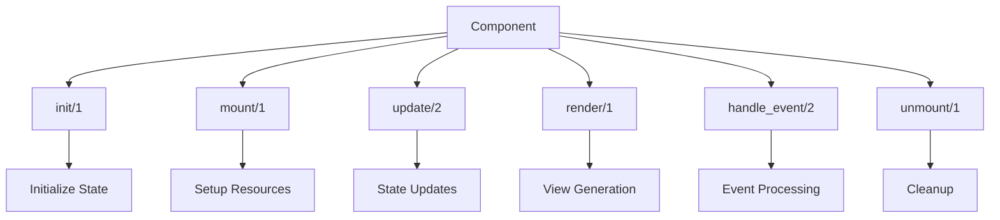
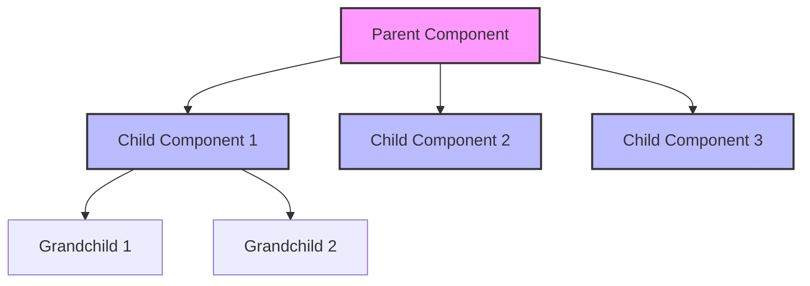
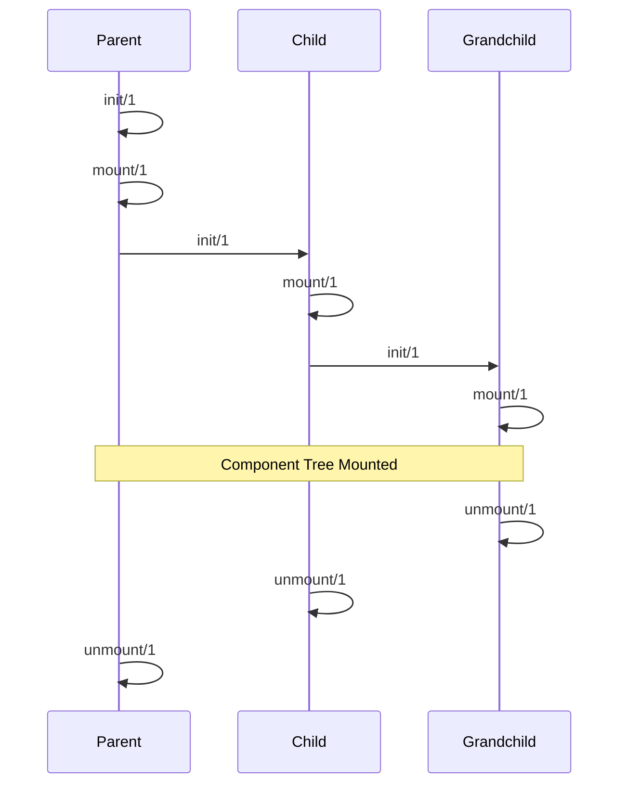
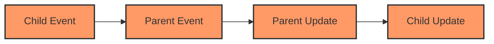

# Raxol Component Architecture

## Table of Contents

1. [Overview](#overview)
2. [Component Structure](#component-structure)
3. [Component Hierarchy](#component-hierarchy)
4. [Component Lifecycle](#component-lifecycle)
5. [Best Practices](#best-practices)
6. [Testing](#testing)
7. [Communication Patterns](#communication-patterns)
8. [Error Handling](#error-handling)
9. [Performance Considerations](#performance-considerations)
10. [Common Patterns](#common-patterns)
11. [Migration Guide](#migration-guide)

## Overview

Raxol's component system provides a robust, hierarchical UI framework with clear communication patterns and lifecycle management. Components are reusable, stateful modules that implement a standard behaviour and support a clear lifecycle:



### Key Concepts

- **Stateful Components**: Each component maintains its own state and can update it through well-defined callbacks
- **Unidirectional Data Flow**: Data flows down through props and up through events
- **Lifecycle Management**: Clear lifecycle hooks for setup and cleanup
- **Event System**: Robust event handling with type safety
- **Composition**: Components can be composed to build complex UIs

### Component Callbacks

- `init/1` — Initialize state from props
- `mount/1` — Set up resources after mounting
- `update/2` — Update state in response to messages
- `render/1` — Produce the component's view
- `handle_event/2` — Handle user/system events
- `unmount/1` — Clean up resources

## Component Structure

Every component in Raxol must implement the `Raxol.UI.Components.Base.Component` behaviour, which requires the above callbacks. Components are composed using the `Raxol.View.Elements` DSL, supporting hierarchical parent-child relationships and explicit event propagation.

### Basic Component Example

```elixir
defmodule MyComponent do
  @behaviour Raxol.UI.Components.Base.Component

  def init(props) do
    %{
      id: props[:id],
      value: props[:value] || "",
      error: nil
    }
  end

  def mount(state) do
    # Setup resources
    {state, []}
  end

  def update({:set_value, value}, state) do
    {put_in(state, [:value], value), []}
  end

  def render(state) do
    %{
      type: :text_input,
      value: state.value,
      error: state.error
    }
  end

  def handle_event(%{type: :change, value: value}, state) do
    {put_in(state, [:value], value), []}
  end

  def unmount(state) do
    # Cleanup resources
    state
  end
end
```

### Advanced Component Example

```elixir
defmodule AdvancedComponent do
  @behaviour Raxol.UI.Components.Base.Component

  def init(props) do
    %{
      id: props[:id],
      data: props[:initial_data] || [],
      loading: false,
      error: nil,
      children: %{}
    }
  end

  def mount(state) do
    # Setup subscriptions, timers, etc.
    {state, [
      {:subscribe, :data_updates},
      {:timer, :refresh, 5000}
    ]}
  end

  def update({:data_updated, new_data}, state) do
    {put_in(state, [:data], new_data), []}
  end

  def update({:child_event, child_id, event}, state) do
    # Handle child events
    {state, []}
  end

  def render(state) do
    %{
      type: :container,
      children: [
        %{
          type: :loading_indicator,
          visible: state.loading
        },
        %{
          type: :error_message,
          visible: state.error != nil,
          message: state.error
        },
        %{
          type: :data_list,
          items: state.data
        }
      ]
    }
  end

  def handle_event(%{type: :refresh}, state) do
    {put_in(state, [:loading], true), [
      {:command, :fetch_data}
    ]}
  end

  def unmount(state) do
    # Cleanup subscriptions, timers, etc.
    state
  end
end
```

## Component Hierarchy

### Parent-Child Relationships



### Parent Component Responsibilities

- Manage child components and track their state
- Handle child events and coordinate updates
- Maintain child lifecycle
- Provide context and shared resources
- Handle child errors and recovery

### Child Component Responsibilities

- Communicate state changes up via events/commands
- Receive updates from parent
- Maintain local state
- Handle local errors
- Clean up local resources

## Component Lifecycle



### Mounting Process

1. Parent components mount first
2. Children mount in order
3. Each component's `mount/1` callback is called
4. State initialization occurs
5. Resources are set up
6. Subscriptions are established

### Unmounting Process

1. Children unmount first
2. Parent unmounts last
3. Each component's `unmount/1` callback is called
4. Cleanup occurs in reverse order
5. Resources are released
6. Subscriptions are cancelled

## Best Practices

### State Management

- Keep state minimal and focused
- Use immutable updates
- Track child states in parent
- Use typed events and proper error handling
- Minimize state updates and use efficient data structures

### Performance State Management

- Use immutable updates with `Map.put/3` and `Map.update/4`
- Batch related state updates
- Minimize state size and complexity
- Use efficient data structures

### Component Design

- Single Responsibility Principle
- Clear component boundaries
- Predictable data flow
- Reusable components
- Well-documented interfaces

### Performance

- Implement `should_update?/2`
- Use efficient data structures
- Cache expensive computations
- Batch related updates
- Clean up resources properly

## Testing

### Unit Testing

```elixir
defmodule MyComponentTest do
  use Raxol.ComponentCase

  test "initializes with default state" do
    assert {:ok, state} = MyComponent.init(%{})
    assert state.value == ""
    assert state.error == nil
  end

  test "handles value changes" do
    {:ok, state} = MyComponent.init(%{})
    {new_state, _} = MyComponent.handle_event(%{type: :change, value: "new value"}, state)
    assert new_state.value == "new value"
  end
end
```

### Integration Testing

```elixir
defmodule ComponentIntegrationTest do
  use Raxol.IntegrationCase

  test "parent-child communication" do
    # Test parent-child interaction
  end

  test "lifecycle management" do
    # Test mounting and unmounting
  end
end
```

## Communication Patterns

### Event Propagation



### Upward Communication

```elixir
# Child component
def handle_event(%{type: :click}, state) do
  {state, [{:command, {:notify_parent, :clicked}}]}
end

# Parent component
def update({:child_event, child_id, :clicked}, state) do
  # Handle child click
  {state, []}
end
```

### Downward Communication

```elixir
# Parent component
def handle_event(%{type: :update_children}, state) do
  commands = Enum.map(state.children, fn child_id ->
    {:command, {:child_event, child_id, :update}}
  end)
  {state, commands}
end

# Child component
def update({:parent_event, :update}, state) do
  # Handle parent update
  {state, []}
end
```

## Error Handling

### Error Recovery Strategies

1. **Child Errors**

   - Parent components remain stable
   - Child state is preserved
   - Error events are logged
   - Recovery mechanisms are triggered

2. **Parent Errors**
   - Children remain stable
   - Parent state is preserved
   - Error events are logged
   - Recovery mechanisms are triggered

### Error Boundary Example

```elixir
defmodule ErrorBoundary do
  @behaviour Raxol.UI.Components.Base.Component

  def init(props) do
    %{
      id: props[:id],
      children: props[:children] || [],
      error: nil
    }
  end

  def update({:child_error, error}, state) do
    {put_in(state, [:error], error), []}
  end

  def render(state) do
    if state.error do
      %{
        type: :error_display,
        error: state.error
      }
    else
      %{
        type: :container,
        children: state.children
      }
    end
  end
end
```

## Performance Considerations

### Rendering

- Implement `should_update?/2` for performance optimization
- Use efficient data structures
- Cache expensive computations
- Avoid unnecessary re-renders

### Event Handling

- Debounce frequent events
- Throttle expensive operations
- Clean up event listeners
- Use efficient event patterns

### Memory Management

- Clean up resources in `unmount/1`
- Avoid memory leaks in event handlers
- Use proper garbage collection
- Monitor memory usage

## Common Patterns

### Form Handling

```elixir
defmodule FormComponent do
  @behaviour Raxol.UI.Components.Base.Component

  def init(props) do
    %{
      id: props[:id],
      fields: props[:fields] || %{},
      errors: %{},
      submitting: false
    }
  end

  def handle_event(%{type: :submit}, state) do
    {put_in(state, [:submitting], true), [
      {:command, {:submit_form, state.fields}}
    ]}
  end
end
```

### Data Loading

```elixir
defmodule DataLoader do
  @behaviour Raxol.UI.Components.Base.Component

  def init(props) do
    %{
      id: props[:id],
      data: nil,
      loading: false,
      error: nil
    }
  end

  def mount(state) do
    {put_in(state, [:loading], true), [
      {:command, :load_data}
    ]}
  end
end
```

## Migration Guide

### From Version 1.x to 2.x

1. Update component callbacks
2. Migrate state management
3. Update event handling
4. Review lifecycle changes
5. Update testing approach

### From Version 2.x to 3.x

1. Adopt new component structure
2. Update communication patterns
3. Implement new error handling
4. Review performance optimizations
5. Update documentation

## Related Documentation

- [Component Style Guide](./style_guide.md)
- [Component Testing Guide](./testing.md)
- [Component Composition Patterns](./composition.md)
