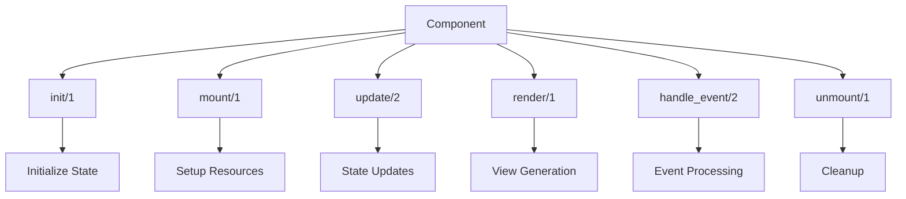
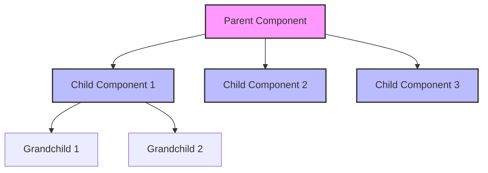
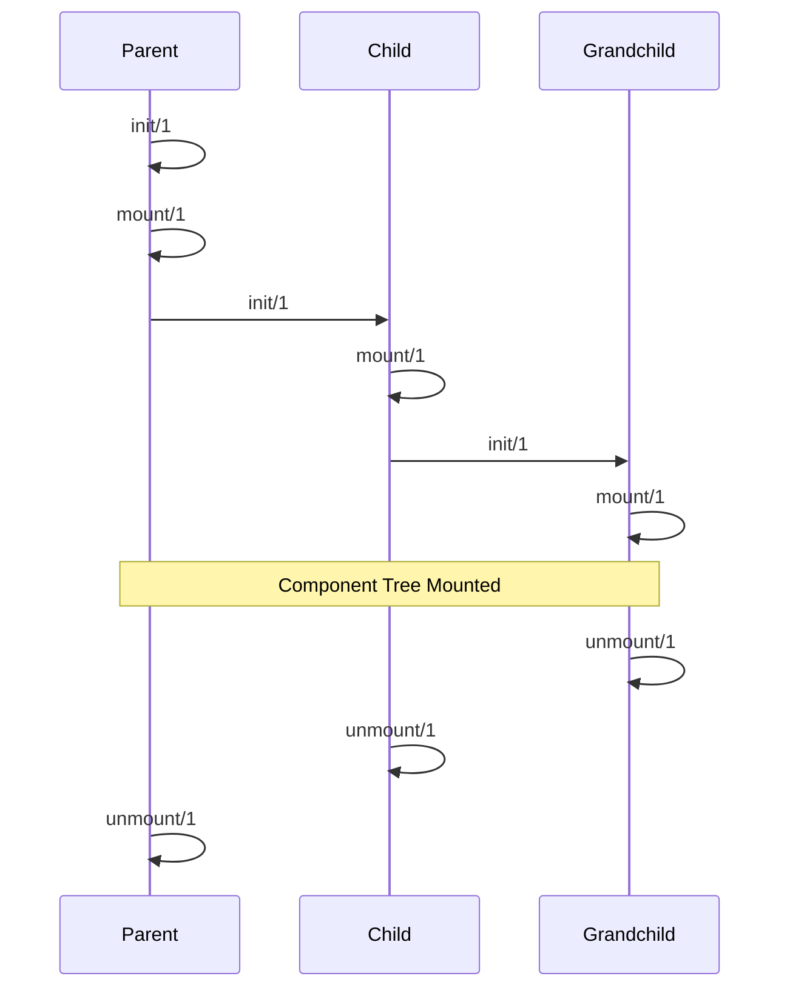
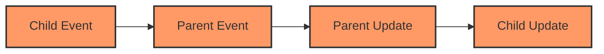

# Raxol Component Architecture

> See also: [Component API Reference](./api_reference.md) for callback signatures and types.

## Table of Contents

1. [Overview](#overview)
2. [Component Structure](#component-structure)
3. [Component Hierarchy](#component-hierarchy)
4. [Component Lifecycle](#component-lifecycle)
5. [Best Practices](#best-practices)
6. [Testing](#testing)
7. [Communication Patterns](#communication-patterns)
8. [Error Handling](#error-handling)
9. [Performance Considerations](#performance-considerations)

## Overview

Raxol's component system provides a robust, hierarchical UI framework with clear communication patterns and lifecycle management. Components are reusable, stateful modules that implement a standard behaviour and support a clear lifecycle:



- `init/1` — Initialize state from props
- `mount/1` — Set up resources after mounting
- `update/2` — Update state in response to messages
- `render/1` — Produce the component's view
- `handle_event/2` — Handle user/system events
- `unmount/1` — Clean up resources

## Component Structure

Every component in Raxol must implement the `Raxol.UI.Components.Base.Component` behaviour, which requires the above callbacks. Components are composed using the `Raxol.View.Elements` DSL, supporting hierarchical parent-child relationships and explicit event propagation.

Example component structure:

```elixir
defmodule MyComponent do
  @behaviour Raxol.UI.Components.Base.Component

  def init(props) do
    %{
      id: props[:id],
      value: props[:value] || "",
      error: nil
    }
  end

  def mount(state) do
    # Setup resources
    {state, []}
  end

  def update({:set_value, value}, state) do
    {put_in(state, [:value], value), []}
  end

  def render(state) do
    %{
      type: :text_input,
      value: state.value,
      error: state.error
    }
  end

  def handle_event(%{type: :change, value: value}, state) do
    {put_in(state, [:value], value), []}
  end

  def unmount(state) do
    # Cleanup resources
    state
  end
end
```

## Component Hierarchy

### Parent-Child Relationships



- **Parent Components:**
  - Manage child components and track their state
  - Handle child events and coordinate updates
  - Maintain child lifecycle
- **Child Components:**
  - Communicate state changes up via events/commands
  - Receive updates from parent
  - Maintain local state

Events propagate up and down the component tree, enabling rich interactivity and predictable state management.

## Component Lifecycle



- **Mounting:**
  1. Parent components mount first
  2. Children mount in order
  3. Each component's `mount/1` callback is called
  4. State initialization occurs
- **Unmounting:**
  1. Children unmount first
  2. Parent unmounts last
  3. Each component's `unmount/1` callback is called
  4. Cleanup occurs in reverse order

## Best Practices

- Keep state minimal and focused
- Use immutable updates
- Track child states in parent
- Use typed events and proper error handling
- Minimize state updates and use efficient data structures
- Test components in isolation using provided helpers

## Testing

Components should be tested for:

- Unit behavior and state management
- Parent-child relationships and event propagation
- Lifecycle (mounting/unmounting, state persistence, error recovery)

## Communication Patterns

### Event Propagation



1. **Upward Communication**

   - Children notify parents through commands
   - Parents receive updates via `update/2` callback
   - State changes are tracked in parent's `child_states`

2. **Downward Communication**
   - Parents send events to children
   - Children receive updates via `update/2` callback
   - State synchronization is maintained

### Broadcast Events

Components can broadcast events to multiple children:

```elixir
# Parent broadcasting to children
def handle_event(%{type: :broadcast, value: value}, state) do
  commands = Enum.map(state.children, fn child_id ->
    {:command, {:child_event, child_id, value}}
  end)
  {state, commands}
end
```

## Error Handling

### Graceful Error Recovery

1. **Child Errors**

   - Parent components remain stable
   - Child state is preserved
   - Error events are logged

2. **Parent Errors**
   - Children remain stable
   - Parent state is preserved
   - Error events are logged

## Performance Considerations

### State Management

- Use immutable updates with `Map.put/3` and `Map.update/4`
- Batch related state updates
- Minimize state size and complexity

### Rendering

- Implement `should_update?/2` for performance optimization
- Use efficient data structures
- Cache expensive computations

### Event Handling

- Debounce frequent events
- Throttle expensive operations
- Clean up event listeners

### Memory Management

- Clean up resources in `unmount/1`
- Avoid memory leaks in event handlers
- Use proper garbage collection

Example performance optimization:

```elixir
def should_update?(new_state, old_state) do
  # Only update if relevant state changed
  new_state.value != old_state.value or
    new_state.error != old_state.error
end

def handle_event(%{type: :input} = event, state) do
  # Debounce input events
  Process.send_after(self(), {:debounced_input, event.value}, 100)
  {state, []}
end
```

## Related Documentation

- [Component API Reference](./api_reference.md)
- [Component Style Guide](./style_guide.md)
- [Component Testing Guide](./testing.md)
- [Component Composition Patterns](./composition.md)
