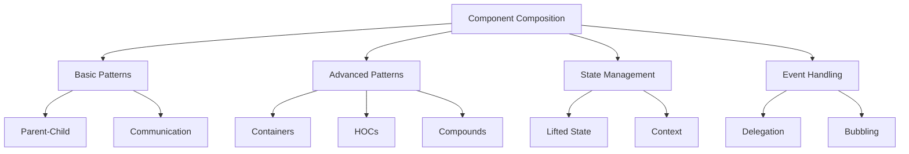

# Raxol Component Composition Patterns

> See also: [Component Architecture](./component_architecture.md) for general component patterns.

## Table of Contents

1. [Overview](#overview)
2. [Basic Composition](#basic-composition)
3. [Advanced Patterns](#advanced-patterns)
4. [State Management Patterns](#state-management-patterns)
5. [Event Handling Patterns](#event-handling-patterns)
6. [Performance Considerations](#performance-considerations)
7. [Best Practices](#best-practices)
8. [Common Pitfalls](#common-pitfalls)
9. [API Reference](#api-reference)
10. [Related Documentation](#related-documentation)

## Overview

This document outlines common patterns for composing components in Raxol, including parent-child relationships, component communication, and state management across component hierarchies. Understanding these patterns is crucial for building maintainable and scalable applications.



## Basic Composition

### Parent-Child Relationship

```elixir
defmodule ParentComponent do
  use Raxol.UI.Components.Base

  def init(props) do
    {:ok, state} = Component.init(%{
      id: :parent,
      children: [],
      child_states: %{}
    })
    {state, []}
  end

  def mount(state) do
    # Initialize child components
    children = [
      ChildComponent.new(%{parent_id: :parent, value: "Child 1"}),
      ChildComponent.new(%{parent_id: :parent, value: "Child 2"})
    ]
    {put_in(state, [:children], children), []}
  end

  def render(state) do
    %{
      type: :parent,
      children: Enum.map(state.children, &render_child/1)
    }
  end

  def handle_event(%{type: :child_event, child_id: child_id} = event, state) do
    # Handle child events
    {new_state, commands} = process_child_event(event, state)
    {new_state, commands}
  end

  defp render_child(child) do
    child.render(child.state)
  end

  defp process_child_event(event, state) do
    # Process child event and update state
    {state, []}
  end
end

defmodule ChildComponent do
  use Raxol.UI.Components.Base

  def init(props) do
    {:ok, state} = Component.init(%{
      id: props[:id],
      parent_id: props[:parent_id],
      value: props[:value]
    })
    {state, []}
  end

  def render(state) do
    %{
      type: :child,
      value: state.value
    }
  end

  def handle_event(%{type: :click}, state) do
    # Notify parent of event
    {state, [{:command, {:notify_parent, state.parent_id, state}}]}
  end
end
```

### Component Communication

1. **Event Propagation**

```elixir
# Parent component
def handle_event(%{type: :child_event, child_id: child_id} = event, state) do
  case event.action do
    :update ->
      # Update child state
      new_state = update_child_state(state, child_id, event.value)
      {new_state, []}
    :delete ->
      # Remove child
      new_state = remove_child(state, child_id)
      {new_state, []}
    _ ->
      {state, []}
  end
end

# Child component
def handle_event(%{type: :click}, state) do
  # Propagate event to parent
  {state, [{:command, {:notify_parent, state.parent_id, %{
    type: :child_event,
    action: :update,
    value: state.value
  }}}]}
end
```

2. **State Synchronization**

```elixir
# Parent component
def update({:child_updated, child_id, new_state}, state) do
  # Update child state
  new_state = put_in(state.child_states[child_id], new_state)
  # Notify other children if needed
  commands = notify_children_of_update(state, child_id)
  {new_state, commands}
end

# Child component
def update(:parent_update, state) do
  # Update based on parent state
  new_state = update_from_parent(state)
  {new_state, []}
end
```

## Advanced Patterns

### Container Components

```elixir
defmodule ContainerComponent do
  use Raxol.UI.Components.Base

  def init(props) do
    {:ok, state} = Component.init(%{
      id: props[:id],
      items: props[:items] || [],
      render_item: props[:render_item],
      on_item_select: props[:on_item_select],
      filter: props[:filter] || & &1,
      sort: props[:sort] || & &1
    })
    {state, []}
  end

  def render(state) do
    items = state.items
      |> Enum.filter(state.filter)
      |> Enum.sort_by(state.sort)
      |> Enum.map(&render_item(&1, state))

    %{
      type: :container,
      items: items
    }
  end

  def handle_event(%{type: :item_select, index: index}, state) do
    item = Enum.at(state.items, index)
    {state, [{:command, {:call, state.on_item_select, [item]}}]}
  end

  defp render_item(item, state) do
    state.render_item.(item)
  end
end
```

### Higher-Order Components

```elixir
defmodule WithErrorBoundary do
  def wrap(component, error_handler) do
    %{
      type: :error_boundary,
      component: component,
      error_handler: error_handler,
      error: nil
    }
  end

  def handle_event(event, state) do
    try do
      component.handle_event(event, state)
    rescue
      error ->
        new_state = %{state | error: error}
        state.error_handler.(error)
        {new_state, []}
    end
  end

  def render(state) do
    if state.error do
      %{
        type: :error,
        message: "An error occurred: #{inspect(state.error)}"
      }
    else
      state.component.render(state.component.state)
    end
  end
end
```

### Compound Components

```elixir
defmodule Tabs do
  use Raxol.UI.Components.Base

  def init(props) do
    {:ok, state} = Component.init(%{
      id: props[:id],
      tabs: props[:tabs] || [],
      active_tab: props[:active_tab] || 0,
      on_tab_change: props[:on_tab_change]
    })
    {state, []}
  end

  def render(state) do
    %{
      type: :tabs,
      header: render_header(state),
      content: render_content(state)
    }
  end

  def handle_event(%{type: :tab_select, index: index}, state) do
    new_state = %{state | active_tab: index}
    {new_state, [{:command, {:call, state.on_tab_change, [index]}}]}
  end

  defp render_header(state) do
    %{
      type: :tab_header,
      tabs: Enum.with_index(state.tabs),
      active_tab: state.active_tab
    }
  end

  defp render_content(state) do
    %{
      type: :tab_content,
      content: Enum.at(state.tabs, state.active_tab)
    }
  end
end
```

## State Management Patterns

### Lifted State

```elixir
defmodule ParentComponent do
  use Raxol.UI.Components.Base

  def init(props) do
    {:ok, state} = Component.init(%{
      id: props[:id],
      shared_state: props[:initial_state] || %{},
      children: []
    })
    {state, []}
  end

  def update({:update_shared_state, new_state}, state) do
    # Update shared state
    new_state = Map.merge(state.shared_state, new_state)
    # Notify children
    commands = notify_children_of_update(state, new_state)
    {new_state, commands}
  end

  defp notify_children_of_update(state, new_state) do
    Enum.map(state.children, fn child ->
      {:command, {:update_child, child.id, new_state}}
    end)
  end
end
```

### Context Provider

```elixir
defmodule ThemeProvider do
  use Raxol.UI.Components.Base

  def init(props) do
    {:ok, state} = Component.init(%{
      id: props[:id],
      theme: props[:theme] || %{},
      children: props[:children] || []
    })
    {state, []}
  end

  def render(state) do
    # Merge theme with context
    context = %{theme: state.theme}

    # Render children with new context
    children = Enum.map(state.children, fn child ->
      child.render(child.state, context)
    end)

    %{
      type: :theme_provider,
      children: children
    }
  end

  def update({:update_theme, new_theme}, state) do
    new_state = %{state | theme: new_theme}
    {new_state, []}
  end
end
```

## Event Handling Patterns

### Event Delegation

```elixir
defmodule EventDelegator do
  use Raxol.UI.Components.Base

  def init(props) do
    {:ok, state} = Component.init(%{
      id: props[:id],
      handlers: props[:handlers] || %{},
      children: props[:children] || []
    })
    {state, []}
  end

  def handle_event(event, state) do
    case Map.get(state.handlers, event.type) do
      nil -> {state, []}
      handler -> handler.(event, state)
    end
  end

  def render(state) do
    %{
      type: :event_delegator,
      children: state.children
    }
  end
end
```

### Event Bubbling

```elixir
defmodule EventBubbler do
  use Raxol.UI.Components.Base

  def init(props) do
    {:ok, state} = Component.init(%{
      id: props[:id],
      children: props[:children] || []
    })
    {state, []}
  end

  def handle_event(event, state) do
    # Let event bubble up
    {state, [{:command, {:bubble_event, event}}]}
  end

  def render(state) do
    %{
      type: :event_bubbler,
      children: state.children
    }
  end
end
```

## Performance Considerations

### Memoization

```elixir
defmodule MemoizedComponent do
  use Raxol.UI.Components.Base

  def init(props) do
    {:ok, state} = Component.init(%{
      id: props[:id],
      cache: %{}
    })
    {state, []}
  end

  def render(state) do
    # Memoize expensive computations
    result = memoize(state, :expensive_computation, fn ->
      compute_expensive_result(state)
    end)

    %{
      type: :memoized,
      result: result
    }
  end

  defp memoize(state, key, computation) do
    case Map.get(state.cache, key) do
      nil ->
        result = computation.()
        put_in(state, [:cache, key], result)
      cached -> cached
    end
  end
end
```

### Lazy Loading

```elixir
defmodule LazyComponent do
  use Raxol.UI.Components.Base

  def init(props) do
    {:ok, state} = Component.init(%{
      id: props[:id],
      loaded: false,
      content: nil
    })
    {state, []}
  end

  def mount(state) do
    # Load content asynchronously
    Task.start(fn ->
      content = load_content()
      send(self(), {:content_loaded, content})
    end)
    {state, []}
  end

  def render(state) do
    if state.loaded do
      %{
        type: :lazy,
        content: state.content
      }
    else
      %{
        type: :loading
      }
    end
  end
end
```

## Best Practices

1. **Component Design**

   - Keep components focused and single-purpose
   - Use composition over inheritance
   - Implement proper error boundaries
   - Follow the component lifecycle

2. **State Management**

   - Lift state up when needed
   - Use context for global state
   - Implement proper state synchronization
   - Handle state updates efficiently

3. **Event Handling**

   - Use event delegation when appropriate
   - Implement proper event bubbling
   - Handle errors gracefully
   - Clean up event listeners

4. **Performance**
   - Implement memoization for expensive computations
   - Use lazy loading for large components
   - Optimize re-renders
   - Clean up resources properly

## Common Pitfalls

1. **State Management**

   - Avoid prop drilling
   - Don't mutate state directly
   - Handle async state updates properly
   - Clean up subscriptions

2. **Event Handling**

   - Don't forget to clean up event listeners
   - Handle errors in event handlers
   - Avoid event handler memory leaks
   - Use proper event delegation

3. **Performance**
   - Avoid unnecessary re-renders
   - Don't compute expensive values in render
   - Use proper memoization
   - Implement proper cleanup

## API Reference

### Component.init/1

Initializes a new component with the given props.

```elixir
{:ok, state} = Component.init(%{
  id: atom(),
  props: map()
})
```

### Component.render/1

Renders the component with the current state.

```elixir
view = Component.render(state)
```

### Component.update/2

Updates the component state with a message.

```elixir
{new_state, commands} = Component.update(state, message)
```

## Related Documentation

- [Component Architecture](./component_architecture.md)
- [Component Style Guide](./style_guide.md)
- [Component Testing Guide](./testing.md)
- [Table Component](./table.md)
