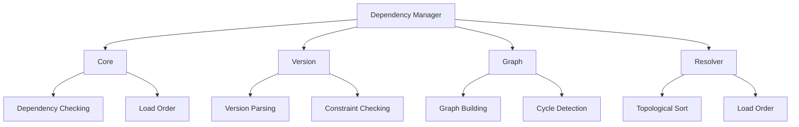

# Dependency Manager Module Architecture

> See also: [Component Architecture](./component_architecture.md) for general component patterns.

## Table of Contents

1. [Overview](#overview)
2. [Module Structure](#module-structure)
3. [State Management](#state-management)
4. [Error Handling](#error-handling)
5. [Usage Examples](#usage-examples)
6. [Best Practices](#best-practices)
7. [Common Pitfalls](#common-pitfalls)
8. [API Reference](#api-reference)
9. [Related Documentation](#related-documentation)

## Overview

The Dependency Manager module is responsible for managing plugin dependencies and resolving load order. It has been refactored into a modular architecture to improve maintainability, testability, and separation of concerns.



## Module Structure

### Main Module: `Raxol.Core.Runtime.Plugins.DependencyManager`

The main module serves as the public API and delegates to specialized submodules. It provides a clean interface for:

- Checking plugin dependencies
- Resolving plugin load order
- Managing version constraints
- Detecting dependency cycles

### Submodules

#### 1. `DependencyManager.Core`

- **Responsibility**: Core dependency checking and load order resolution
- **Key Functions**:
  - `check_dependencies/4`: Verifies if a plugin's dependencies are satisfied
  - `resolve_load_order/1`: Determines the correct load order for plugins
- **Features**:
  - Dependency validation
  - Optional dependency handling
  - Error reporting with dependency chains

Example:

```elixir
defmodule DependencyManager.Core do
  def check_dependencies(plugin_id, metadata, loaded_plugins, opts \\ %{}) do
    with :ok <- validate_metadata(metadata),
         :ok <- check_required_dependencies(plugin_id, metadata, loaded_plugins),
         :ok <- check_optional_dependencies(plugin_id, metadata, loaded_plugins) do
      :ok
    end
  end

  def resolve_load_order(plugins) do
    graph = DependencyManager.Graph.build_dependency_graph(plugins)
    DependencyManager.Resolver.tarjan_sort(graph)
  end
end
```

#### 2. `DependencyManager.Version`

- **Responsibility**: Version parsing and constraint checking
- **Key Functions**:
  - `check_version/2`: Validates version compatibility
  - `parse_version_requirement/1`: Parses version requirement strings
- **Features**:
  - Complex version constraint parsing
  - OR condition support
  - Detailed error reporting

Example:

```elixir
defmodule DependencyManager.Version do
  def check_version(version, requirement) do
    with {:ok, parsed_version} <- parse_version(version),
         {:ok, parsed_requirement} <- parse_version_requirement(requirement) do
      check_version_constraint(parsed_version, parsed_requirement)
    end
  end

  defp parse_version_requirement(requirement) do
    case requirement do
      ">=" <> version -> {:ok, {:gte, parse_version(version)}}
      "<=" <> version -> {:ok, {:lte, parse_version(version)}}
      "~>" <> version -> {:ok, {:compatible, parse_version(version)}}
      _ -> {:error, :invalid_requirement}
    end
  end
end
```

#### 3. `DependencyManager.Graph`

- **Responsibility**: Dependency graph building and analysis
- **Key Functions**:
  - `build_dependency_graph/1`: Creates a dependency graph from plugin metadata
  - `build_dependency_chain/2`: Constructs dependency chains for error reporting
  - `get_all_dependencies/3`: Retrieves all dependencies for a plugin
- **Features**:
  - Graph construction
  - Cycle detection
  - Dependency chain analysis

Example:

```elixir
defmodule DependencyManager.Graph do
  def build_dependency_graph(plugins) do
    plugins
    |> Enum.map(&build_plugin_edges/1)
    |> Enum.reduce(%{}, &merge_edges/2)
  end

  def build_dependency_chain(graph, start, target) do
    case find_path(graph, start, target) do
      {:ok, path} -> {:ok, path}
      :error -> {:error, :no_path}
    end
  end
end
```

#### 4. `DependencyManager.Resolver`

- **Responsibility**: Load order resolution using Tarjan's algorithm
- **Key Functions**:
  - `tarjan_sort/1`: Performs topological sorting of the dependency graph
- **Features**:
  - Efficient cycle detection
  - Strongly connected component identification
  - Topological ordering

Example:

```elixir
defmodule DependencyManager.Resolver do
  def tarjan_sort(graph) do
    {order, cycles} = tarjan(graph)
    if Enum.empty?(cycles) do
      {:ok, order}
    else
      {:error, :circular_dependency, cycles}
    end
  end

  defp tarjan(graph) do
    # Implementation of Tarjan's algorithm
    # Returns {topological_order, cycles}
  end
end
```

## State Management

The Dependency Manager maintains the following state in the dependency graph:

```elixir
%{
  "plugin_id" => [
    {"dependency_id", "version_requirement", %{optional: boolean()}},
    # ... more dependencies
  ],
  # ... more plugins
}
```

Example state:

```elixir
%{
  "core" => [
    {"base", ">= 1.0.0", %{optional: false}},
    {"utils", "~> 2.0", %{optional: true}}
  ],
  "feature_a" => [
    {"core", ">= 1.0.0", %{optional: false}},
    {"feature_b", ">= 1.0.0", %{optional: true}}
  ]
}
```

## Error Handling

The module implements comprehensive error handling:

- Missing dependencies
- Version mismatches
- Circular dependencies
- Invalid version formats
- Invalid requirement formats

Each error type includes detailed information for debugging:

```elixir
# Missing dependencies
{:error, :missing_dependencies, ["missing_plugin"], ["plugin_a", "plugin_b"]}

# Version mismatches
{:error, :version_mismatch, [{"plugin", "1.0.0", ">= 2.0.0"}], ["plugin_a"]}

# Circular dependencies
{:error, :circular_dependency, ["plugin_a", "plugin_b"], ["plugin_a", "plugin_b", "plugin_a"]}

# Invalid version format
{:error, :invalid_version, "1.0.0.0", "Expected format: x.y.z"}

# Invalid requirement format
{:error, :invalid_requirement, ">1.0.0", "Expected format: >= x.y.z"}
```

## Usage Examples

### Basic Dependency Checking

```elixir
# Check plugin dependencies
case DependencyManager.check_dependencies("my_plugin", metadata, loaded_plugins) do
  :ok ->
    # Dependencies satisfied
    {:ok, plugin}
  {:error, :missing_dependencies, missing, chain} ->
    # Handle missing dependencies
    Logger.error("Missing dependencies: #{inspect(missing)}")
    {:error, :missing_dependencies}
  {:error, :version_mismatch, mismatches, chain} ->
    # Handle version mismatches
    Logger.error("Version mismatches: #{inspect(mismatches)}")
    {:error, :version_mismatch}
  {:error, :circular_dependency, cycle, chain} ->
    # Handle circular dependency
    Logger.error("Circular dependency detected: #{inspect(cycle)}")
    {:error, :circular_dependency}
end
```

### Load Order Resolution

```elixir
# Resolve load order
case DependencyManager.resolve_load_order(plugins) do
  {:ok, load_order} ->
    # Load plugins in order
    Enum.each(load_order, fn plugin_id ->
      case load_plugin(plugin_id) do
        :ok -> :ok
        {:error, reason} -> handle_load_error(plugin_id, reason)
      end
    end)
  {:error, :circular_dependency, cycle, chain} ->
    # Handle circular dependency
    Logger.error("Circular dependency detected: #{inspect(cycle)}")
    {:error, :circular_dependency}
end
```

### Version Constraint Checking

```elixir
# Check version compatibility
case DependencyManager.Version.check_version("1.0.0", ">= 2.0.0") do
  :ok ->
    # Version compatible
    :ok
  {:error, :version_mismatch, current, required} ->
    # Handle version mismatch
    Logger.error("Version mismatch: #{current} does not satisfy #{required}")
    {:error, :version_mismatch}
end
```

## Best Practices

1. **Version Constraints**:

   - Use semantic versioning
   - Be specific with version requirements
   - Consider using version ranges for flexibility
   - Document version requirements clearly

2. **Dependency Management**:

   - Keep dependency chains shallow
   - Avoid circular dependencies
   - Use optional dependencies when appropriate
   - Document dependency relationships

3. **Error Handling**:

   - Always check return values
   - Provide meaningful error messages
   - Log dependency issues appropriately
   - Handle all error cases gracefully

4. **Testing**:
   - Test all error cases
   - Verify version constraint handling
   - Test complex dependency scenarios
   - Verify cycle detection
   - Test edge cases

## Common Pitfalls

1. **Version Management**:

   - Not specifying version constraints
   - Using overly strict version requirements
   - Not handling version conflicts properly
   - Ignoring version compatibility

2. **Dependency Structure**:

   - Creating deep dependency chains
   - Introducing circular dependencies
   - Not handling optional dependencies
   - Not documenting dependencies

3. **Error Handling**:
   - Not checking return values
   - Not providing detailed error messages
   - Not handling all error cases
   - Not logging dependency issues

## API Reference

### DependencyManager.check_dependencies/4

Checks if a plugin's dependencies are satisfied.

```elixir
{:ok, plugin} | {:error, reason} = DependencyManager.check_dependencies(
  plugin_id,
  metadata,
  loaded_plugins,
  opts \\ %{}
)
```

### DependencyManager.resolve_load_order/1

Resolves the load order for a set of plugins.

```elixir
{:ok, load_order} | {:error, reason} = DependencyManager.resolve_load_order(plugins)
```

### DependencyManager.Version.check_version/2

Checks if a version satisfies a requirement.

```elixir
:ok | {:error, reason} = DependencyManager.Version.check_version(version, requirement)
```

## Related Documentation

- [Component Architecture](./component_architecture.md)
- [Component Style Guide](./style_guide.md)
- [Component Testing Guide](./testing.md)
- [Table Component](./table.md)
