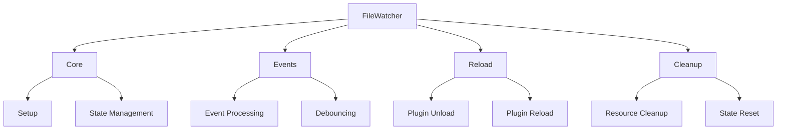

# FileWatcher Module Architecture

> See also: [Component Architecture](./component_architecture.md) for general component patterns.

## Table of Contents

1. [Overview](#overview)
2. [Module Structure](#module-structure)
3. [State Management](#state-management)
4. [Event Flow](#event-flow)
5. [Error Handling](#error-handling)
6. [Usage Examples](#usage-examples)
7. [Best Practices](#best-practices)
8. [Common Pitfalls](#common-pitfalls)
9. [API Reference](#api-reference)
10. [Related Documentation](#related-documentation)

## Overview

The FileWatcher module is responsible for monitoring plugin source files and triggering reloads when changes are detected. It has been refactored into a modular architecture to improve maintainability, testability, and separation of concerns.



## Module Structure

### Main Module: `Raxol.Core.Runtime.Plugins.FileWatcher`

The main module serves as the public API and delegates to specialized submodules. It provides a clean interface for:

- Setting up file watching
- Handling file events
- Managing plugin reloads
- Cleaning up resources

### Submodules

#### 1. `FileWatcher.Core`

- **Responsibility**: Core setup and state management
- **Key Functions**:
  - `setup_file_watching/1`: Initializes the file system watcher
  - `update_file_watcher/1`: Maintains the reverse path mapping for plugin files
- **Features**:
  - Directory tracking
  - Path mapping management
  - State initialization
  - Resource allocation

Example:

```elixir
defmodule FileWatcher.Core do
  def setup_file_watching(state) do
    with {:ok, pid} <- start_file_system_watcher(state.plugin_dirs),
         :ok <- initialize_state(pid) do
      {pid, true}
    end
  end

  def update_file_watcher(state) do
    reverse_paths = build_reverse_paths(state.plugin_paths)
    %{state | reverse_plugin_paths: reverse_paths}
  end
end
```

#### 2. `FileWatcher.Events`

- **Responsibility**: Event handling and debouncing
- **Key Functions**:
  - `handle_file_event/2`: Processes file system events
  - `handle_debounced_events/3`: Manages debounced plugin reloads
- **Features**:
  - Path normalization
  - Event debouncing
  - File type validation
  - Timer management

Example:

```elixir
defmodule FileWatcher.Events do
  def handle_file_event(event, state) do
    with {:ok, normalized_path} <- normalize_path(event.path),
         :ok <- validate_file_type(normalized_path),
         :ok <- cancel_existing_timer(state.file_event_timer) do
      schedule_debounced_reload(normalized_path, state)
    end
  end

  defp schedule_debounced_reload(path, state) do
    timer_id = System.unique_integer([:positive])
    Process.send_after(self(), {:debounced_reload, path, timer_id}, 1000)
    %{state | file_event_timer: timer_id}
  end
end
```

#### 3. `FileWatcher.Reload`

- **Responsibility**: Plugin reloading logic
- **Key Functions**:
  - `reload_plugin/2`: Handles the plugin reload process
- **Process**:
  1. Verifies plugin existence
  2. Unloads the current plugin
  3. Reloads the plugin from source
  4. Handles errors and edge cases

Example:

```elixir
defmodule FileWatcher.Reload do
  def reload_plugin(plugin_id, state) do
    with :ok <- verify_plugin_exists(plugin_id),
         :ok <- unload_plugin(plugin_id),
         {:ok, _} <- load_plugin_from_source(plugin_id) do
      {:ok, state}
    end
  end
end
```

#### 4. `FileWatcher.Cleanup`

- **Responsibility**: Resource cleanup
- **Key Functions**:
  - `cleanup_file_watching/1`: Cleans up file watching resources
- **Features**:
  - Process termination
  - Timer cancellation
  - State cleanup
  - Idempotent operations

Example:

```elixir
defmodule FileWatcher.Cleanup do
  def cleanup_file_watching(state) do
    with :ok <- terminate_file_watcher(state.file_watcher_pid),
         :ok <- cancel_timer(state.file_event_timer) do
      reset_state(state)
    end
  end
end
```

## State Management

The FileWatcher maintains the following state:

```elixir
%{
  plugin_dirs: [String.t()],           # List of directories to watch
  plugin_paths: %{String.t() => String.t()},  # Plugin ID to path mapping
  reverse_plugin_paths: %{String.t() => String.t()},  # Path to plugin ID mapping
  file_watcher_pid: pid() | nil,       # File system watcher process
  file_event_timer: reference() | nil,  # Debounce timer reference
  file_watching_enabled?: boolean()    # File watching status
}
```

## Event Flow

1. **File Change Detection**:

   - File system watcher detects changes
   - Event is passed to `handle_file_event/2`

2. **Event Processing**:

   - Path is normalized
   - File type is validated
   - Existing timer is cancelled if present
   - New debounce timer is scheduled

3. **Debounced Reload**:

   - Timer triggers after debounce period
   - `handle_debounced_events/3` is called
   - Plugin is reloaded via `reload_plugin/2`

4. **Cleanup**:
   - Resources are cleaned up on shutdown
   - Processes are terminated
   - Timers are cancelled
   - State is reset

## Error Handling

The module implements comprehensive error handling:

```elixir
# File access errors
{:error, :file_access, path, reason}

# Plugin not found
{:error, :plugin_not_found, plugin_id}

# Unload failures
{:error, :unload_failed, plugin_id, reason}

# Load failures
{:error, :load_failed, plugin_id, reason}

# Unexpected errors
{:error, :unexpected_error, reason}
```

## Usage Examples

### Basic File Watching Setup

```elixir
# Initialize file watching
state = %{
  plugin_dirs: ["plugins"],
  plugin_paths: %{"my_plugin" => "plugins/my_plugin.ex"},
  file_watching_enabled?: false
}

# Setup file watching
{pid, enabled?} = FileWatcher.setup_file_watching(state)
state = %{state | file_watcher_pid: pid, file_watching_enabled?: enabled?}

# Update file watcher with new paths
state = FileWatcher.update_file_watcher(state)

# Cleanup on shutdown
state = FileWatcher.cleanup_file_watching(state)
```

### Handling File Events

```elixir
# Handle file change event
def handle_info({:file_event, path}, state) do
  case FileWatcher.Events.handle_file_event(%{path: path}, state) do
    {:ok, new_state} -> {:noreply, new_state}
    {:error, reason} ->
      Logger.error("File event handling failed: #{inspect(reason)}")
      {:noreply, state}
  end
end

# Handle debounced reload
def handle_info({:debounced_reload, path}, state) do
  case FileWatcher.Reload.reload_plugin(path, state) do
    {:ok, new_state} -> {:noreply, new_state}
    {:error, reason} ->
      Logger.error("Plugin reload failed: #{inspect(reason)}")
      {:noreply, state}
  end
end
```

## Best Practices

1. **State Management**:

   - Always update state atomically
   - Use immutable state updates
   - Handle all state transitions explicitly
   - Validate state invariants

2. **Error Handling**:

   - Use pattern matching for error cases
   - Provide detailed error messages
   - Log errors appropriately
   - Handle cleanup in error cases

3. **Resource Management**:

   - Clean up resources promptly
   - Handle cleanup failures gracefully
   - Ensure idempotent cleanup operations
   - Monitor resource usage

4. **Testing**:
   - Test all error cases
   - Verify state transitions
   - Mock external dependencies
   - Test concurrent operations
   - Verify cleanup behavior

## Common Pitfalls

1. **Resource Management**:

   - Not cleaning up file watchers
   - Memory leaks from uncancelled timers
   - Process leaks from unhandled errors
   - State inconsistency after errors

2. **Event Handling**:

   - Missing debouncing
   - Race conditions in event processing
   - Incorrect path normalization
   - Unhandled file system events

3. **Plugin Reloading**:

   - Not unloading before reloading
   - Missing error handling during reload
   - State inconsistency after failed reloads
   - Circular reload dependencies

4. **Testing**:
   - Not testing cleanup scenarios
   - Missing concurrent operation tests
   - Incomplete error case coverage
   - Not verifying state invariants

## API Reference

### FileWatcher.setup_file_watching/1

Sets up file watching for the given state.

```elixir
{pid(), boolean()} | {:error, reason()} = FileWatcher.setup_file_watching(state())
```

### FileWatcher.update_file_watcher/1

Updates the file watcher with new plugin paths.

```elixir
state() = FileWatcher.update_file_watcher(state())
```

### FileWatcher.cleanup_file_watching/1

Cleans up file watching resources.

```elixir
state() | {:error, reason()} = FileWatcher.cleanup_file_watching(state())
```

### FileWatcher.Events.handle_file_event/2

Handles a file system event.

```elixir
{:ok, state()} | {:error, reason()} = FileWatcher.Events.handle_file_event(event(), state())
```

### FileWatcher.Reload.reload_plugin/2

Reloads a plugin from source.

```elixir
{:ok, state()} | {:error, reason()} = FileWatcher.Reload.reload_plugin(plugin_id(), state())
```

## Related Documentation

- [Component Architecture](./component_architecture.md)
- [Component Style Guide](./style_guide.md)
- [Component Testing Guide](./testing.md)
- [Dependency Manager](./dependency_manager.md)
