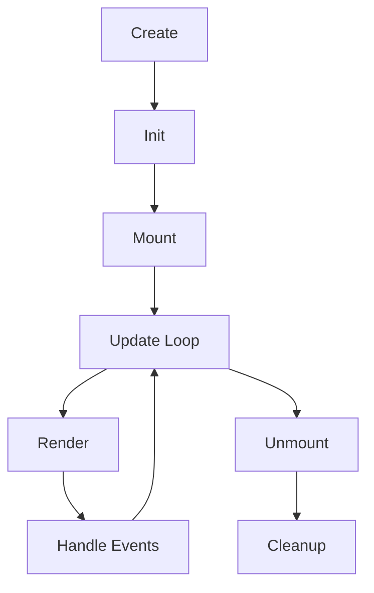

# Component Lifecycle

Comprehensive guide to the Raxol component lifecycle, covering initialization, mounting, updates, rendering, and unmounting in both terminal and web environments.

## Overview

Raxol components follow a predictable lifecycle inspired by modern UI frameworks. Components work identically in both terminal and web environments, with the framework handling the differences transparently.

## Lifecycle Phases



## Phase Details

### 1. Init (Initialization)

The `init/1` callback is called once when a component is created. It receives props and returns the initial state.

```elixir
@impl true
def init(props) do
  %{
    # Required state
    value: props[:value] || "",
    focused: false,
    
    # Internal state
    cursor_position: 0,
    selection: nil,
    
    # Web-specific state
    viewport: props[:viewport] || %{width: 80, height: 24},
    theme: props[:theme] || :auto
  }
end
```

**Key Points:**
- Called exactly once per component instance
- Receives props from parent component
- Must return initial state as a map
- Should be pure (no side effects)
- Same behavior in terminal and web

### 2. Mount

The `mount/1` callback is called after initialization, when the component is added to the component tree.

```elixir
@impl true
def mount(state) do
  # Perform setup operations
  commands = [
    {:subscribe, "user:#{state.user_id}"},
    {:start_timer, :auto_save, 30_000},
    {:focus, self()}
  ]
  
  # Return updated state and commands
  {Map.put(state, :mounted, true), commands}
end
```

**Common Mount Operations:**
- Subscribe to external events
- Start timers or intervals  
- Request focus
- Load async data
- Initialize resources

**Web-Specific Mount:**
```elixir
def mount(state) do
  commands = if state.context.platform == :web do
    [
      {:connect_websocket, state.session_id},
      {:track_presence, state.user_id}
    ]
  else
    []
  end
  
  {state, commands}
end
```

### 3. Update

The `update/2` callback handles state changes triggered by parent components or internal events.

```elixir
@impl true
def update(message, state) do
  case message do
    {:set_value, new_value} ->
      # Update state
      new_state = %{state | value: new_value}
      
      # Emit commands
      commands = [{:notify_parent, {:value_changed, new_value}}]
      
      {new_state, commands}
      
    {:focus} ->
      {%{state | focused: true}, []}
      
    {:blur} ->
      {%{state | focused: false}, []}
      
    _ ->
      {state, []}
  end
end
```

**Update Patterns:**
```elixir
# Batch updates
def update({:batch, updates}, state) do
  new_state = Enum.reduce(updates, state, fn update, acc ->
    elem(update(update, acc), 0)
  end)
  {new_state, [{:command, :batch_complete}]}
end

# Async updates
def update({:async_result, {:ok, data}}, state) do
  {%{state | data: data, loading: false}, []}
end
```

### 4. Render

The `render/1` or `render/2` callback generates the visual representation of the component.

```elixir
@impl true
def render(state, context) do
  %{
    type: :box,
    style: render_style(state),
    content: [
      render_header(state),
      render_content(state, context),
      render_footer(state)
    ]
  }
end

defp render_style(state) do
  [
    border: if(state.focused, do: :double, else: :single),
    padding: 1,
    background: state.theme.background,
    foreground: state.theme.foreground
  ]
end
```

**Platform-Aware Rendering:**
```elixir
def render(state, context) do
  base_content = render_base(state)
  
  # Add platform-specific enhancements
  if context.platform == :web do
    Map.merge(base_content, %{
      # Web-specific attributes
      attributes: %{
        "data-testid" => state.id,
        "aria-label" => state.label,
        "tabindex" => if(state.focusable, do: "0", else: "-1")
      },
      # CSS classes for web styling
      class: "raxol-component #{state.custom_class}"
    })
  else
    base_content
  end
end
```

### 5. Handle Events

The `handle_event/2` callback processes user interactions and system events.

```elixir
@impl true
def handle_event(event, state) do
  case event do
    # Keyboard events (terminal & web)
    %{type: :key_press, key: :enter} ->
      {state, [{:command, :submit}]}
      
    %{type: :key_press, key: {:char, char}} ->
      new_state = insert_character(state, char)
      {new_state, [{:notify_parent, {:text_changed, new_state.value}}]}
      
    # Mouse events (terminal with mouse support & web)
    %{type: :mouse_click, x: x, y: y, button: button} ->
      handle_click(state, x, y, button)
      
    # Web-specific events
    %{type: :drag_start, data: data} ->
      {%{state | dragging: data}, []}
      
    %{type: :file_drop, files: files} ->
      {state, [{:command, {:process_files, files}}]}
      
    # Touch events (web mobile)
    %{type: :touch_start, touches: touches} ->
      handle_touch(state, touches)
      
    _ ->
      {state, []}
  end
end
```

### 6. Unmount

The `unmount/1` callback is called when a component is removed from the component tree.

```elixir
@impl true
def unmount(state) do
  # Cleanup operations
  cleanup_commands = [
    {:unsubscribe, "user:#{state.user_id}"},
    {:cancel_timer, :auto_save},
    {:close_connections, state.connections}
  ]
  
  # Return final state for logging/debugging
  {%{state | mounted: false}, cleanup_commands}
end
```

**Important Cleanup:**
- Unsubscribe from events
- Cancel timers
- Close connections
- Release resources
- Save state if needed

## Advanced Lifecycle Patterns

### Lifecycle Hooks

```elixir
defmodule MyComponent do
  use Raxol.UI.Components.Base.Component
  use Raxol.Components.Lifecycle.Hooks
  
  # Before mount
  before_mount do
    validate_props()
    setup_connections()
  end
  
  # After mount
  after_mount do
    log_mount_time()
    track_analytics(:component_mounted)
  end
  
  # Before update
  before_update(old_state, new_state) do
    validate_state_transition(old_state, new_state)
  end
  
  # After render
  after_render(rendered) do
    cache_render_result(rendered)
  end
  
  # Before unmount
  before_unmount do
    save_component_state()
  end
end
```

### Error Boundaries

```elixir
defmodule SafeComponent do
  use Raxol.UI.Components.Base.Component
  use Raxol.Components.ErrorBoundary
  
  @impl true
  def handle_error(error, state) do
    Logger.error("Component error: #{inspect(error)}")
    
    # Return fallback UI
    fallback_state = %{state | error: error, show_error: true}
    {fallback_state, [{:notify_error, error}]}
  end
  
  @impl true
  def render(state) do
    if state.show_error do
      render_error_ui(state.error)
    else
      render_normal_ui(state)
    end
  end
end
```

### Suspense and Lazy Loading

```elixir
defmodule LazyComponent do
  use Raxol.UI.Components.Base.Component
  use Raxol.Components.Suspense
  
  @impl true
  def init(props) do
    %{
      data: :loading,
      component: nil
    }
  end
  
  @impl true
  def mount(state) do
    {state, [{:load_async, :component_and_data}]}
  end
  
  @impl true
  def render(state) do
    case state.data do
      :loading ->
        # Show loading state
        render_loading()
        
      {:error, error} ->
        # Show error state
        render_error(error)
        
      {:ok, data} ->
        # Render loaded component
        render_component(state.component, data)
    end
  end
end
```

## Web Compatibility

### Lifecycle in Web Context

When components run in web browsers via Phoenix LiveView:

1. **Init**: Happens on the server
2. **Mount**: Triggers after WebSocket connection
3. **Update**: Synchronized via WebSocket
4. **Render**: Translated to HTML/CSS
5. **Events**: Mapped from DOM events
6. **Unmount**: Handles disconnect/navigation

### Web-Specific Lifecycle Events

```elixir
def handle_event(%{type: :websocket_connect}, state) do
  # Connection established
  {%{state | connected: true}, [{:sync_state, state}]}
end

def handle_event(%{type: :websocket_disconnect}, state) do
  # Connection lost - enter degraded mode
  {%{state | connected: false}, [{:enable_offline_mode}]}
end

def handle_event(%{type: :page_visibility, visible: visible}, state) do
  # Handle tab visibility changes
  if visible do
    {state, [{:resume_updates}]}
  else
    {state, [{:pause_updates}]}
  end
end
```

## Performance Considerations

### Optimizing Lifecycle Methods

```elixir
defmodule OptimizedComponent do
  use Raxol.UI.Components.Base.Component
  
  # Minimize init work
  def init(props) do
    # Only essential initialization
    %{id: props.id, loaded: false}
  end
  
  # Defer expensive operations to mount
  def mount(state) do
    {state, [{:load_data_async, state.id}]}
  end
  
  # Efficient updates
  def update({:data_loaded, data}, state) do
    # Only update changed fields
    new_state = %{state | 
      data: data,
      loaded: true
    }
    
    # Skip render if not visible
    if state.visible do
      {new_state, [{:request_render}]}
    else
      {new_state, []}
    end
  end
  
  # Memoized rendering
  def render(state) do
    # Use ETS cache for expensive renders
    case :ets.lookup(:render_cache, state.id) do
      [{_, cached}] when cached.version == state.version ->
        cached.rendered
        
      _ ->
        rendered = do_expensive_render(state)
        :ets.insert(:render_cache, {state.id, %{
          version: state.version,
          rendered: rendered
        }})
        rendered
    end
  end
end
```

## Testing Lifecycle

```elixir
defmodule ComponentLifecycleTest do
  use ExUnit.Case
  import Raxol.ComponentTestHelpers
  
  describe "component lifecycle" do
    test "full lifecycle flow" do
      # Create component
      component = create_test_component(MyComponent, %{value: "test"})
      
      # Verify init
      assert component.state.value == "test"
      
      # Simulate mount
      {state, commands} = MyComponent.mount(component.state)
      assert state.mounted == true
      assert {:subscribe, _} in commands
      
      # Simulate updates
      {state, _} = MyComponent.update({:set_value, "new"}, state)
      assert state.value == "new"
      
      # Verify render
      rendered = MyComponent.render(state)
      assert rendered.type == :box
      
      # Simulate unmount
      {final_state, cleanup} = MyComponent.unmount(state)
      assert {:unsubscribe, _} in cleanup
    end
  end
end
```

## Best Practices

1. **Keep Init Pure**: No side effects in initialization
2. **Mount for Setup**: Use mount for subscriptions and async operations
3. **Batch Updates**: Group related state changes
4. **Efficient Rendering**: Minimize render calculations
5. **Proper Cleanup**: Always clean up in unmount
6. **Error Handling**: Implement error boundaries
7. **Test Lifecycle**: Test all lifecycle methods

## Common Pitfalls

1. **Side Effects in Init**: Don't perform I/O in init
2. **Missing Cleanup**: Always unmount subscriptions/timers
3. **Render Side Effects**: Keep render pure
4. **State Mutations**: Always return new state
5. **Event Handler Errors**: Handle all event types

## Next Steps

- Review [Component Testing](../../examples/guides/05_development_and_testing/testing.md) patterns
- Learn about [Performance](../../examples/guides/05_development_and_testing/development/planning/performance/PerformanceOptimization.md) optimization
- Explore [Web Rendering](README.md#web-rendering) specifics