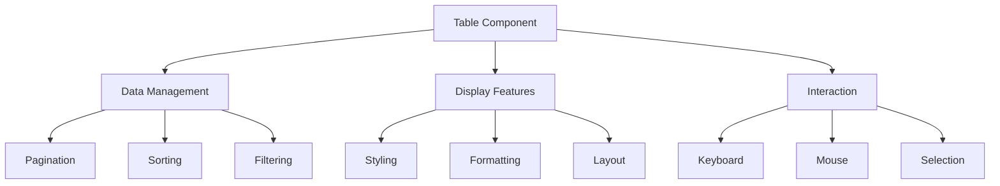

# Table Component

> See also: [Component Architecture](./component_architecture.md) for general component patterns.

## Table of Contents

1. [Overview](#overview)
2. [Basic Usage](#basic-usage)
3. [Column Configuration](#column-configuration)
4. [Features](#features)
5. [Styling](#styling)
6. [Event Handling](#event-handling)
7. [Performance Considerations](#performance-considerations)
8. [Testing](#testing)
9. [Best Practices](#best-practices)
10. [Common Patterns](#common-patterns)
11. [API Reference](#api-reference)
12. [Related Documentation](#related-documentation)

## Overview

The Table component is a powerful, flexible component for displaying tabular data with features like sorting, filtering, pagination, and custom styling. It's designed to handle both small and large datasets efficiently while providing a rich set of customization options.



## Basic Usage

```elixir
defmodule MyTable do
  use Raxol.UI.Components.Base

  def init(props) do
    {:ok, state} = Table.init(%{
      id: :my_table,
      columns: [
        %{header: "ID", key: :id, width: 4, align: :right},
        %{header: "Name", key: :name, width: 10, align: :left},
        %{header: "Age", key: :age, width: 5, align: :center}
      ],
      data: [
        %{id: 1, name: "Alice", age: 25},
        %{id: 2, name: "Bob", age: 30}
      ],
      options: %{
        paginate: true,
        page_size: 10,
        sortable: true,
        searchable: true
      }
    })
    {state, []}
  end

  def render(state) do
    Table.render(state)
  end
end
```

## Column Configuration

### Column Properties

| Property     | Type                         | Description                    | Default  |
| ------------ | ---------------------------- | ------------------------------ | -------- |
| `header`     | String                       | Display text for column header | Required |
| `key`        | Atom or Function             | Data accessor                  | Required |
| `width`      | Integer or `:auto`           | Column width                   | `:auto`  |
| `align`      | `:left`, `:right`, `:center` | Text alignment                 | `:left`  |
| `format`     | Function                     | Cell value formatter           | `& &1`   |
| `sortable`   | Boolean                      | Enable sorting                 | `false`  |
| `searchable` | Boolean                      | Enable searching               | `false`  |

Example with all features:

```elixir
columns = [
  %{
    header: "ID",
    key: :id,
    width: 4,
    align: :right,
    format: &String.Chars.to_string/1,
    sortable: true
  },
  %{
    header: "Full Name",
    key: fn row -> "#{row.first} #{row.last}" end,
    width: 20,
    align: :left,
    format: & &1,
    searchable: true
  },
  %{
    header: "Status",
    key: :status,
    width: 10,
    align: :center,
    format: fn status ->
      case status do
        "active" -> {:green, "● Active"}
        "inactive" -> {:red, "● Inactive"}
        _ -> {:yellow, "● Pending"}
      end
    end
  }
]
```

## Features

### Pagination

```elixir
{:ok, state} = Table.init(%{
  # ... other props ...
  options: %{
    paginate: true,
    page_size: 10,
    page_controls: true,  # Show page navigation
    page_info: true      # Show "Showing X-Y of Z items"
  }
})
```

### Sorting

```elixir
{:ok, state} = Table.init(%{
  # ... other props ...
  options: %{
    sortable: true,
    default_sort: {:name, :asc},
    multi_sort: true
  }
})

# Handle sort events
def handle_event(%{type: :sort, column: column, direction: direction}, state) do
  sorted_data = Table.sort(state.data, column, direction)
  {put_in(state, [:data], sorted_data), []}
end
```

### Filtering

```elixir
{:ok, state} = Table.init(%{
  # ... other props ...
  options: %{
    searchable: true,
    search_fields: [:name, :email],  # Fields to search in
    search_placeholder: "Search...",
    case_sensitive: false
  }
})

# Handle search events
def handle_event(%{type: :search, query: query}, state) do
  filtered_data = Table.filter(state.data, query, state.options.search_fields)
  {put_in(state, [:data], filtered_data), []}
end
```

## Styling

### Border Styles

```elixir
{:ok, state} = Table.init(%{
  # ... other props ...
  border: :single,  # or :double, :none
  border_style: [:bright_black],
  header_border: :double
})
```

### Row Styling

```elixir
{:ok, state} = Table.init(%{
  # ... other props ...
  striped: true,
  row_style: fn row_index, row_data ->
    cond do
      row_data.status == "error" -> [fg: :red, bg: :bright_black]
      row_data.status == "warning" -> [fg: :yellow]
      true -> []
    end
  end,
  hover_style: [bg: :bright_black]
})
```

### Header Styling

```elixir
{:ok, state} = Table.init(%{
  # ... other props ...
  header_style: [:bold, :bright_white],
  header_bg: :bright_black,
  header_border: :double
})
```

## Event Handling

### Keyboard Navigation

```elixir
def handle_event(%{type: :key, key: key}, state) do
  case key do
    :up -> {Table.select_previous_row(state), []}
    :down -> {Table.select_next_row(state), []}
    :page_up -> {Table.previous_page(state), []}
    :page_down -> {Table.next_page(state), []}
    :enter -> {Table.toggle_row_selection(state), []}
    _ -> {state, []}
  end
end
```

### Mouse Events

```elixir
def handle_event(%{type: :click, target: target}, state) do
  case target do
    {:header, column} -> {Table.sort_column(state, column), []}
    {:row, index} -> {Table.select_row(state, index), []}
    {:cell, {row, col}} -> {Table.select_cell(state, row, col), []}
    _ -> {state, []}
  end
end
```

## Performance Considerations

### Large Datasets

```elixir
{:ok, state} = Table.init(%{
  # ... other props ...
  options: %{
    paginate: true,
    page_size: 50,
    virtual_scroll: true,
    window_size: 100
  }
})
```

### Rendering Optimization

```elixir
def should_update?(new_state, old_state) do
  # Only update if relevant state changed
  new_state.data != old_state.data or
    new_state.page != old_state.page or
    new_state.sort != old_state.sort
end
```

## Testing

### Unit Tests

```elixir
describe "Table Features" do
  test "initializes with default options" do
    {:ok, state} = Table.init(%{
      id: :test_table,
      columns: columns,
      data: data
    })

    assert state.options == %{
      paginate: false,
      searchable: false,
      sortable: false,
      page_size: 10
    }
  end

  test "handles empty data" do
    {:ok, state} = Table.init(%{
      columns: columns,
      data: []
    })

    view = Table.render(state)
    assert view.type == :border
    [header | rows] = get_in(view, [:children, Access.at(0)])
    assert length(rows) == 0
  end

  test "sorts data correctly" do
    {:ok, state} = Table.init(%{
      columns: columns,
      data: data,
      options: %{sortable: true}
    })

    sorted_state = Table.sort_column(state, :name)
    assert sorted_state.data == Enum.sort_by(data, & &1.name)
  end
end
```

### Integration Tests

```elixir
describe "Table Integration" do
  test "combines with other components" do
    columns = [
      %{
        header: "Chart",
        key: :data,
        width: 20,
        format: fn data ->
          Chart.new(
            type: :sparkline,
            data: data,
            width: 20
          )
        end
      }
    ]

    {:ok, state} = Table.init(%{
      columns: columns,
      data: [%{data: [1, 2, 3, 4, 5]}]
    })

    view = Table.render(state)
    assert view.type == :border
    [header | [row]] = get_in(view, [:children, Access.at(0)])
    assert row.children[0].type == :chart
  end
end
```

## Best Practices

1. **Column Design**

   - Keep column widths reasonable
   - Use appropriate alignment
   - Implement efficient formatters
   - Consider mobile responsiveness

2. **Data Management**

   - Use efficient data structures
   - Implement proper pagination
   - Handle empty states
   - Cache expensive computations

3. **Performance**

   - Minimize re-renders
   - Use efficient sorting/filtering
   - Implement proper cleanup
   - Use virtual scrolling for large datasets

4. **Accessibility**
   - Provide keyboard navigation
   - Use semantic markup
   - Support screen readers
   - Include ARIA attributes

## Common Patterns

### Dynamic Updates

```elixir
def handle_event(%{type: :data_update, data: new_data}, state) do
  # Update data while preserving sort/filter state
  updated_state = Table.update_data(state, new_data)
  {updated_state, []}
end
```

### Row Selection

```elixir
def handle_event(%{type: :row_select, index: index}, state) do
  # Toggle row selection
  updated_state = Table.toggle_row_selection(state, index)
  {updated_state, [{:command, {:row_selected, index, updated_state.selection}}]}
end
```

### Custom Cell Rendering

```elixir
def render_cell(value, column, row) do
  case column.key do
    :status -> render_status(value)
    :progress -> render_progress_bar(value)
    :actions -> render_action_buttons(row)
    _ -> value
  end
end
```

## API Reference

### Table.init/1

Initializes a new table component with the given props.

```elixir
{:ok, state} = Table.init(%{
  id: atom(),
  columns: [column()],
  data: [map()],
  options: options()
})
```

### Table.render/1

Renders the table component with the current state.

```elixir
view = Table.render(state)
```

### Table.update/2

Updates the table state with new data or options.

```elixir
{new_state, commands} = Table.update(state, message)
```

## Related Documentation

- [Component Architecture](./component_architecture.md)
- [Component Style Guide](./style_guide.md)
- [Component Testing Guide](./testing.md)
- [Component Composition Patterns](./composition.md)
