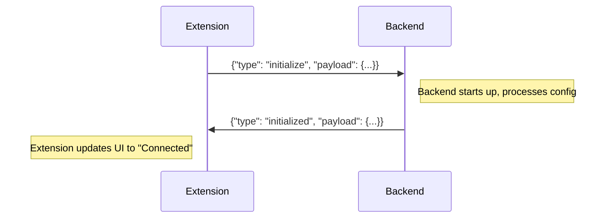

# Extension <-> Backend Communication Protocol

This document specifies the communication protocol used between the Raxol VS Code extension frontend/host and the Raxol Elixir backend process. Communication occurs via standard input (stdin) and standard output (stdout) using JSON-formatted messages.

## General Message Structure

All messages exchanged follow this basic structure:

```json
{
  "type": "message_type_string",
  "payload": {
    // Message-specific data
  }
}
```

- `"type"`: A string identifying the kind of message being sent.
- `"payload"`: An object containing the data relevant to the message type.

## Message Types

### Extension -> Backend

Messages sent _from_ the VS Code Extension _to_ the Elixir Backend.

1.  **`initialize`**

    - **Direction:** Extension -> Backend
    - **Purpose:** Sent by the extension when it first starts the backend process. Includes initial configuration or context needed by the backend.
    - **Payload Example:**
      ```json
      {
        "type": "initialize",
        "payload": {
          "workspaceRoot": "/path/to/user/workspace",
          "initialWidth": 80,
          "initialHeight": 24,
          "extensionVersion": "0.1.0"
          // Other initial settings as needed
        }
      }
      ```

2.  **`user_input`**

    - **Direction:** Extension -> Backend
    - **Purpose:** Sends user interactions from the Webview/UI to the backend for processing.
    - **Payload Example (Key Press):**
      ```json
      {
        "type": "user_input",
        "payload": {
          "inputType": "key",
          "key": "Enter", // Or "a", "Ctrl+c", etc.
          "modifiers": ["Ctrl"] // Optional: e.g., ["Ctrl", "Shift"]
        }
      }
      ```
    - **Payload Example (Mouse Event - TBD):**
      ```json
      // Structure to be defined if mouse interaction is needed
      {
        "type": "user_input",
        "payload": {
          "inputType": "mouse",
          "eventType": "click", // "scroll", "drag", etc.
          "x": 10,
          "y": 5,
          "button": "left" // "right", "middle"
        }
      }
      ```

3.  **`resize_panel`**

    - **Direction:** Extension -> Backend
    - **Purpose:** Informs the backend that the containing panel or view has been resized.
    - **Payload Example:**
      ```json
      {
        "type": "resize_panel",
        "payload": {
          "width": 120,
          "height": 40
        }
      }
      ```

4.  **`shutdown`**
    - **Direction:** Extension -> Backend
    - **Purpose:** Signals the backend to perform a graceful shutdown.
    - **Payload Example:**
      ```json
      {
        "type": "shutdown",
        "payload": {}
      }
      ```

### Backend -> Extension

Messages sent _from_ the Elixir Backend _to_ the VS Code Extension.

1.  **`initialized`**

    - **Direction:** Backend -> Extension
    - **Purpose:** Confirms that the backend has successfully initialized after receiving the `initialize` message.
    - **Payload Example:**
      ```json
      {
        "type": "initialized",
        "payload": {
          "backendVersion": "0.1.0",
          "pid": 12345 // Optional: Backend process ID
        }
      }
      ```

2.  **`ui_update`**

    - **Direction:** Backend -> Extension
    - **Purpose:** Sends UI state updates to the extension for rendering in the Webview. This could be a full state snapshot or a differential update.
    - **Payload Example (Simplified - Structure TBD):**
      ```json
      {
        "type": "ui_update",
        "payload": {
          "updateType": "full", // or "diff"
          "viewState": {
            // Complete or partial representation of the UI state
            // e.g., Grid of cells, component tree, etc.
            "cells": [
              [
                { "char": "H", "fg": "white", "bg": "black" },
                { "char": "i", "fg": "white", "bg": "black" }
              ],
              [
                { "char": ">", "fg": "green", "bg": "black" },
                { "char": " ", "fg": "white", "bg": "black" }
              ]
            ],
            "cursor": { "x": 1, "y": 1, "visible": true }
          }
        }
      }
      ```
      _Note: The exact structure of `viewState` needs further definition based on the rendering approach chosen for the Webview._

3.  **`log_message`**

    - **Direction:** Backend -> Extension
    - **Purpose:** Sends logging information from the backend to be displayed in the extension's output channel or debug console.
    - **Payload Example:**
      ```json
      {
        "type": "log_message",
        "payload": {
          "level": "info", // "debug", "warn", "error"
          "message": "Backend process started successfully."
        }
      }
      ```

4.  **`error`**
    - **Direction:** Backend -> Extension
    - **Purpose:** Reports a critical error that occurred in the backend.
    - **Payload Example:**
      ```json
      {
        "type": "error",
        "payload": {
          "errorCode": "BACKEND_CRASH", // Specific error code/type
          "message": "Unhandled exception occurred in rendering loop.",
          "details": "Optional stack trace or further info"
        }
      }
      ```

## Sequence Diagram (Example: Initialization)



## Future Considerations

- **Differential UI Updates:** Define a clear format for `ui_update` messages with `updateType: "diff"` to minimize data transfer.
- **Request/Response Patterns:** Introduce message IDs for specific request/response pairs if needed (e.g., getting specific data from the backend).
- **Binary Payloads:** Consider base64 encoding or alternative methods if large binary data needs transfer (e.g., images, though unlikely via stdio).
- **Protocol Versioning:** Add a protocol version field to the `initialize` / `initialized` handshake.
