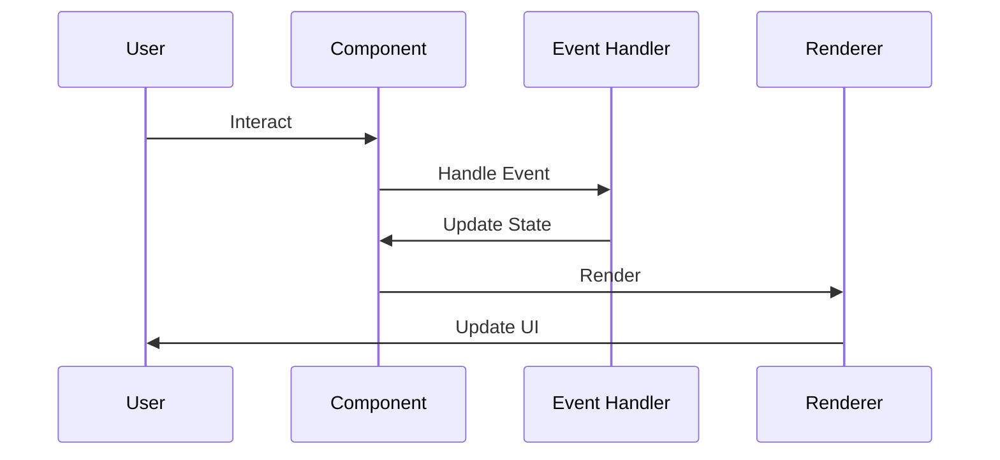

# Raxol Examples

A collection of examples demonstrating Raxol's features and capabilities.

## Quick Start

```bash
# Run basic example
mix run examples/basic/counter.exs | cat

# Run showcase example
mix run examples/showcase/component_showcase.exs | cat
```

## Example Categories

### Basic Examples

- **Counter**: Simple state management
- **MultipleViews**: View composition
- **Rendering**: Basic rendering patterns
- **Subscriptions**: Event subscriptions
- **TableFeatures**: Table component usage

### Advanced Examples

- **Commands**: Command pattern implementation
- **DocumentationBrowser**: Documentation viewer
- **Editor**: Text editor implementation
- **Snake**: Game implementation

### Display Examples

- **ProgressBar**: Progress visualization
- **Charts**: Data visualization
- **TreeMaps**: Hierarchical data display

### Interactive Examples

- **FormValidation**: Form handling
- **EventHandling**: Event system usage
- **KeyboardShortcuts**: Shortcut implementation

### Layout Examples

- **Dashboard**: Dashboard layout
- **AdvancedLayout**: Complex layouts
- **Responsive**: Responsive design

### Showcase Examples

- **ComponentShowcase**: Component library
- **ArchitectureDemo**: Architecture patterns
- **ProgressBarDemo**: Progress bar variations

### Without Runtime Examples

- **HelloWorld**: Basic terminal output
- **Clock**: Real-time updates
- **EventViewer**: Event debugging

## Creating Your Own Example

```elixir
defmodule MyApp do
  use Raxol.Component
  alias Raxol.View.Elements

  @impl Raxol.Component
  def mount(_params, _session, socket) do
    {:ok, assign(socket, :message, "Hello from Raxol!")}
  end

  @impl Raxol.Component
  def handle_event("some_event", _payload, socket) do
    {:noreply, assign(socket, :message, "Event handled!")}
  end

  @impl Raxol.Component
  def render(assigns) do
    ~V"""
    <.panel title="My App">
      <.text>{assigns.message}</.text>
      <.button rax-click="some_event">Click Me</.button>
    </.panel>
    """
  end
end
```

## Component Flow



## Best Practices

1. **Structure**

   - Follow directory organization
   - Use appropriate category
   - Include documentation

2. **Implementation**

   - Use component behaviour
   - Handle events properly
   - Follow naming conventions

3. **Documentation**
   - Add file header
   - Document dependencies
   - Include usage examples

## Related Documentation

For more examples, check the [examples directory](docs/examples/README.html).
