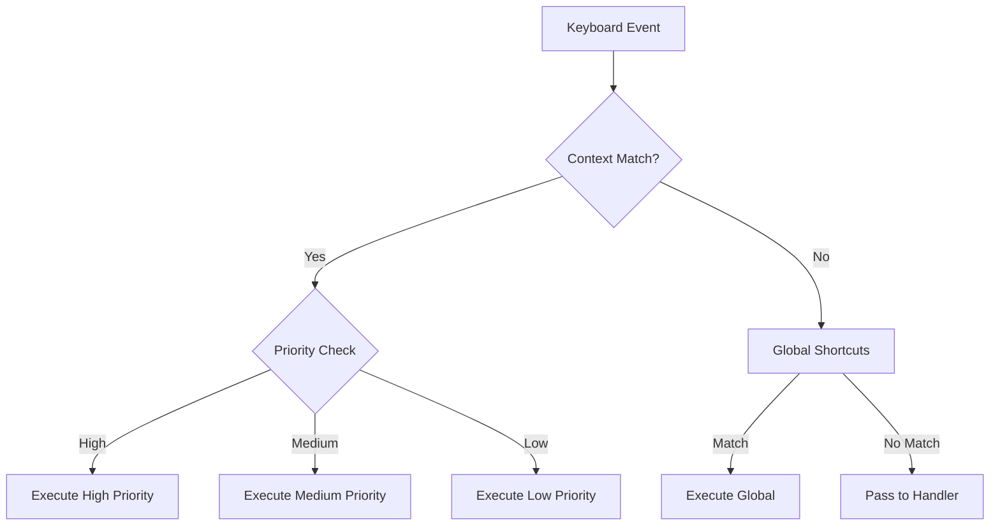
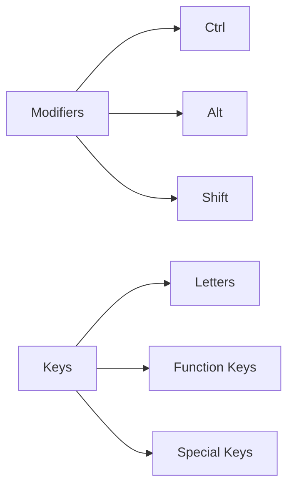
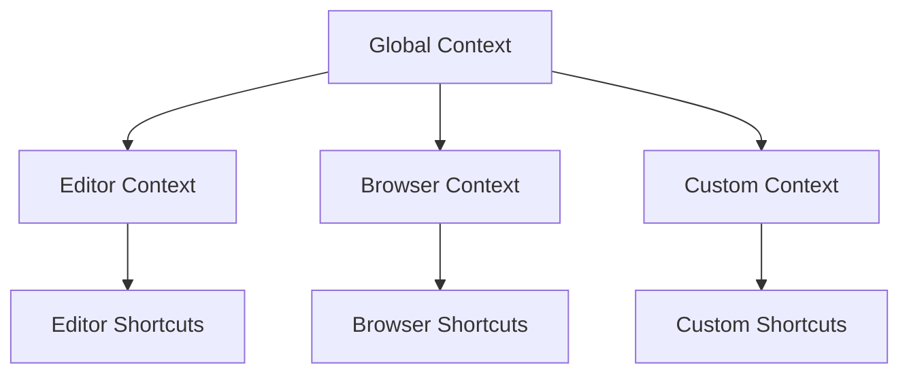
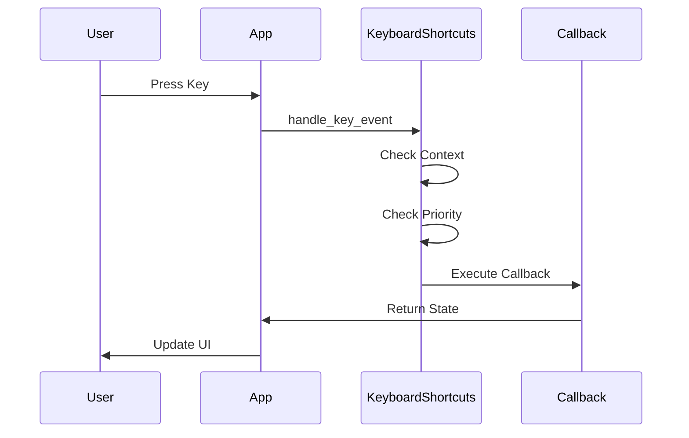
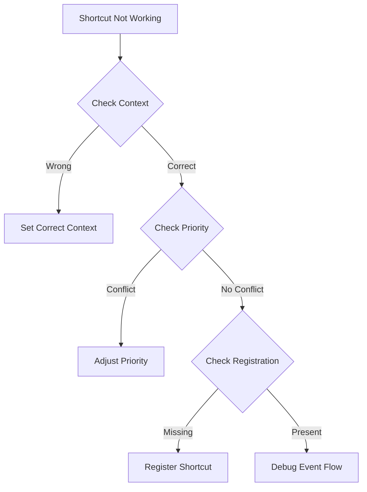

# Raxol Keyboard Shortcuts Guide

A concise guide for implementing and using keyboard shortcuts in Raxol applications.

## Overview



## Quick Start

```elixir
# Initialize shortcuts
Raxol.Core.UXRefinement.init()
Raxol.Core.UXRefinement.enable_feature(:keyboard_shortcuts)

# Register a shortcut
KeyboardShortcuts.register_shortcut(:save, "Ctrl+S", &save_document/0,
  context: :editor,
  description: "Save document"
)
```

## Shortcut Registration

### Basic Format

```elixir
KeyboardShortcuts.register_shortcut(
  :shortcut_name,    # Unique atom
  "Modifier+Key",    # Key combination
  callback_function, # Function to execute
  options           # Additional options
)
```

### Key Combinations



### Context Hierarchy



## Implementation Example

```elixir
defmodule MyApp do
  use Raxol.App
  alias Raxol.Core.KeyboardShortcuts

  def start_link(_opts) do
    # Setup
    UXRefinement.init()
    UXRefinement.enable_feature(:keyboard_shortcuts)

    # Register shortcuts
    KeyboardShortcuts.register_shortcut(:save, "Ctrl+S", &save/0,
      context: :editor,
      priority: :high
    )
    KeyboardShortcuts.register_shortcut(:quit, "Ctrl+Q", &quit/0)

    # Start app
    Raxol.Core.Runtime.Lifecycle.start_application(MyApp)
  end

  @impl true
  def handle_event({:key, key_event}, _from, state) do
    case KeyboardShortcuts.handle_key_event(key_event, state) do
      {:ok, :handled, new_state} -> {:noreply, new_state}
      {:ok, :not_handled, state} -> handle_other_key_input(key_event, state)
      {:error, _reason, state} -> {:noreply, state}
    end
  end
end
```

## Shortcut Flow



## Best Practices

1. **Consistency**

   - Use standard shortcuts (Ctrl+S for save)
   - Maintain consistent patterns

2. **Context Management**

   - Set contexts reliably
   - Use appropriate priorities

3. **Accessibility**
   - Announce actions
   - Provide help display

## Troubleshooting



## Common Issues

1. **Shortcut Not Triggering**

   - Verify context
   - Check key combination
   - Confirm registration

2. **Wrong Shortcut Executing**
   - Review priorities
   - Check context hierarchy
   - Verify registration order

## Reference

### Priority Levels

- `:high` - Overrides all others
- `:medium` - Default level
- `:low` - Lowest priority

### Context Types

- `:global` - Always active
- `:editor` - Editor mode
- `:browser` - Browser mode
- Custom contexts as needed

---

For detailed API reference, see [Keyboard Shortcuts API](../api/keyboard_shortcuts.md).
